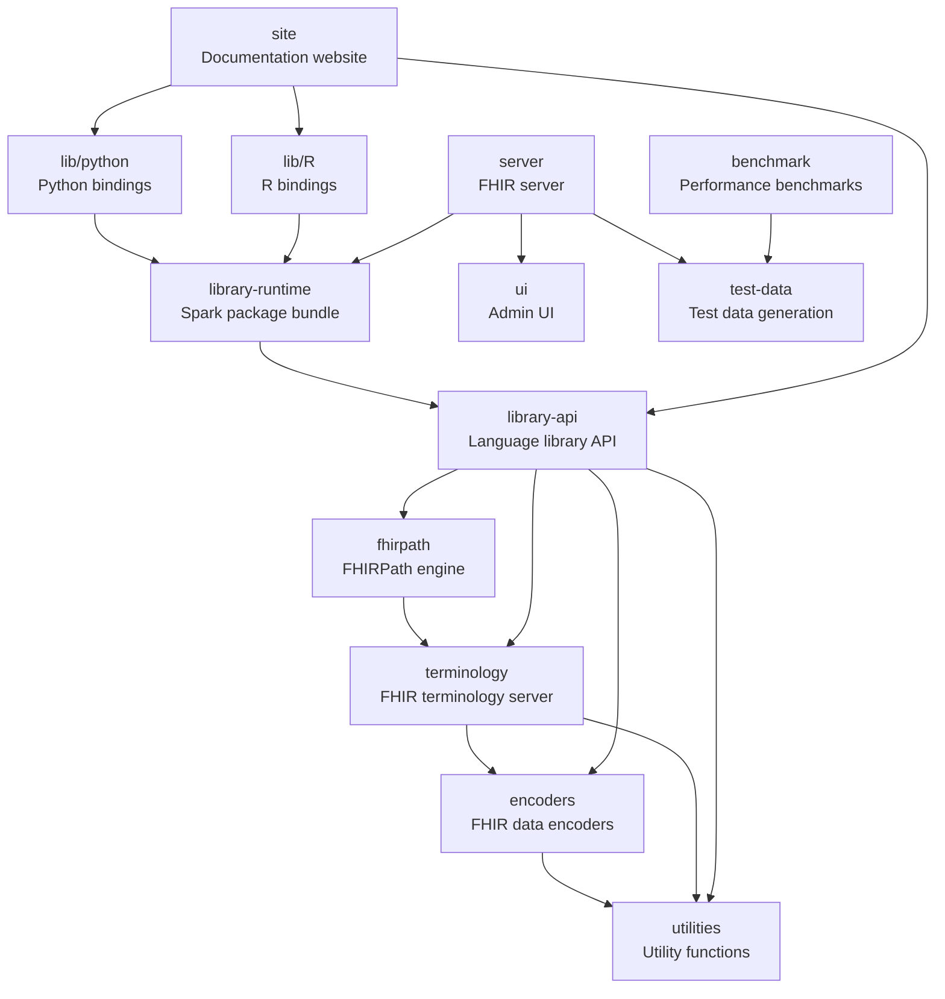

# How to contribute

Thanks for your interest in contributing to Pathling.

You can find out a bit more about Pathling by reading the [README](README.md)
file within this repository.

## Module structure

The core of Pathling consists of the following modules, which inherit from the
main `pom.xml` in the root of the repository:

- `utilities` - Utility functions used by different components of Pathling.
- `encoders` - Encoders for transforming [FHIR](https://hl7.org/fhir/) data into
  Spark Datasets.
- `terminology` - Interact with
  a [FHIR terminology server](https://hl7.org/fhir/terminology-service.html)
  from Spark.
- `fhirpath` - A library that can
  translate [FHIRPath expressions](https://hl7.org/fhirpath/) into Spark
  queries.
- `library-api` - An API that exposes Pathling functionality to language
  libraries.
- `library-runtime` - A Spark package that bundles the Pathling Library API and
  its runtime dependencies for cluster deployment.

These modules build upon the core libraries, and are released and versioned
together with the core. They are also child modules of the main `pom.xml`.

- `lib/python` - Python language bindings for Pathling.
- `lib/R` - R language bindings for Pathling.
- `site` - A website that contains documentation for Pathling.
- `benchmark` - A benchmark for evaluating the performance of Pathling query
  execution.

The following modules are versioned independently and are **not** children of
the main `pom.xml`:

- `server` - A FHIR server implementation built on top of the core libraries.
  See the server [CONTRIBUTING.md](server/CONTRIBUTING.md) for build, test, and
  deployment instructions.
- `ui` - A React-based administration interface for Pathling servers, built and
  rolled into the server Docker image. See the UI
  [CONTRIBUTING.md](ui/CONTRIBUTING.md) for coding conventions and build
  instructions.
- `test-data` - Test data generation utilities used during development.



The "public API" of Pathling is defined as the public API of the library API
module.

## Core libraries

The core libraries are defined as the modules that contribute to building the
library runtime artifact. These are:

- `utilities`
- `encoders`
- `terminology`
- `fhirpath`
- `library-api`
- `library-runtime`

The Python and R libraries are built on top of this API, as well as the server.
This API is also provided for users to build their own applications using the
Pathling functionality.

You will need the following software to build the core libraries:

- Java 21
- Maven 3.9+
- Python 3.9+
- uv (Python package manager)
- R 3.5+

To build and install locally, run:

```
mvn clean install -pl library-runtime -am
```

## Language libraries

### Python library

The Python library is built on top of the core library API and provides Python
bindings for Pathling functionality. It is designed to be used in Python
applications that want to leverage Pathling's capabilities for working with FHIR
data.

You will need the following software to build the Python library:

- Python 3.9+
- uv (Python package manager)

To build and install the Python library locally, run:

```bash
mvn clean install -pl lib/python -am
```

### R library

The R library is built on top of the core library API and provides R bindings
for Pathling functionality. It uses [sparklyr](https://sparklyr.tidyverse.org/)
to provide an interface for working with Spark and FHIR data in R.

You will need R 3.5+ to build the R library.

To build and install the R library locally, run:

```bash
mvn clean install -pl lib/R -am
```

### Clearing the Ivy cache

When rebuilding after making changes to upstream modules, you may need to clear
the local Ivy cache before the changes will be picked up by the Python and R
libraries. The Ivy cache is typically located at `~/.ivy2/cache`.

To clear the cache:

```bash
rm -rf ~/.ivy2/cache
```

After clearing the cache, rebuild the libraries:

```bash
mvn clean install -pl lib/python -am
mvn clean install -pl lib/R -am
```

## Server

The server module is a FHIR server implementation built on top of the core
libraries. It provides a FHIR-compliant API for querying and manipulating FHIR
data using Pathling's capabilities.

The `server` module is versioned independently and has its own
[CONTRIBUTING.md](server/CONTRIBUTING.md) with detailed build, test, and
deployment instructions.

## Admin UI

The `ui` module is a React-based administration interface for managing Pathling
FHIR servers. It is built and rolled into the server Docker image. The module
has its own [CONTRIBUTING.md](ui/CONTRIBUTING.md) with coding conventions,
testing guidelines, and build instructions.

## Coding conventions

### Comments

- All comments must use correct grammar and be written as complete sentences.
- Every comment, including single-line comments, must be terminated with a
  period.
- Comments should clearly explain the purpose or logic of the code they
  annotate.
- Avoid redundant comments that restate obvious code; focus on intent,
  rationale, or non-obvious behaviour.
- Update comments when code changes to keep them accurate and relevant.
- TODOs should not be present in code that is being submitted for review.
  If you have a task that you want to complete in the future, please create an
  issue for it.

### Java

Java code should conform to
the [Google Java Style Guide](https://google.github.io/styleguide/javaguide.html).
Use [google-java-format](https://github.com/google/google-java-format) to format
Java code.

In addition to the style guide, follow these project-specific conventions:

- Avoid the use of inner classes, records and enums - having each class defined
  in its own file is preferred and avoids any implicit dependencies on code
  within the enclosing scope.
- Use `final` for variables, parameters, and methods that should not change.
- Use logging frameworks instead of `System.out` or `System.err` for output.
- Write unit tests for all public methods and critical logic.
- Avoid hardcoding file paths, URLs, or credentials; use configuration files or
  environment variables.
- Use nullability annotations (`jakarta.annotation.Nonnull` and
  `jakarta.annotation.Nullable`) on method parameters, return values, and class
  or record fields.
- Ensure code is free of major bugs, vulnerabilities, and code smells as
  reported by SonarQube.

### Scala

- Use meaningful and descriptive names
  following [Scala conventions](https://docs.scala-lang.org/style/).
- Follow standard Scala naming conventions:
    - Classes and traits: PascalCase (e.g., `MyClass`)
    - Methods and variables: camelCase (e.g., `myVariable`, `calculateTotal`)
    - Constants: UPPER_SNAKE_CASE (e.g., `MAX_SIZE`)
- Prefer immutable data structures and functional programming patterns.
- Use `val` instead of `var` whenever possible.
- Leverage pattern matching instead of complex conditional statements.
- Use case classes for data containers.
- Handle errors with `Option`, `Either`, or `Try` instead of exceptions where
  appropriate.
- Use appropriate collection methods (`map`, `filter`, `fold`) instead of loops.
- Keep methods short and focused on a single responsibility.

### Python

- Follow [PEP 8](https://peps.python.org/pep-0008/) style guidelines.
- Use meaningful and descriptive names with snake_case convention.
- Use type hints for function parameters and return values.
- Use docstrings for all public functions, classes, and modules.
- Prefer list comprehensions over loops where appropriate.
- Use context managers (`with` statements) for resource management.
- Handle exceptions explicitly; avoid bare `except` clauses.
- Write unit tests using [pytest framework](https://pytest.org/).
- Keep imports organized: standard library, third-party, local imports.

### R

- Follow [tidyverse style guide](https://style.tidyverse.org/) conventions.
- Use snake_case for variable and function names.
- Use meaningful and descriptive names.
- Prefer vectorized operations over loops.
- Use the pipe operator (`%>%` or `|>`) for readable data transformations.
- Use appropriate data structures (data.frames, tibbles, lists).
- Document functions with roxygen2 comments.
- Use testthat for unit testing.
- Handle missing values (`NA`) appropriately.
- Use consistent indentation (2 spaces recommended).

### Formatting

This repository uses multiple code formatters:

- [Prettier](https://prettier.io/) for JavaScript/TypeScript code, JSON and YAML
- [Ruff](https://docs.astral.sh/ruff/) for Python code
- [EditorConfig](https://editorconfig.org/) for all other languages

Please use the appropriate formatter to reformat your code before pushing.

### Commit messages

Write commit messages that capture the **objective** of the change, not the
specific implementation details that can be obtained from the diff.

**Structure**:

```
<type>: <succinct description of the objective>

<optional body explaining the why and context>
```

**Types**:

- `fix:` - Bug fixes or resolving warnings/errors
- `feat:` - New features or enhancements
- `refactor:` - Code restructuring without changing behavior
- `docs:` - Documentation updates
- `test:` - Test-related changes
- `chore:` - Build, tooling, or dependency updates

**Guidelines**:

- Focus on **why** the change was needed and **what problem** it solves
- Avoid mentioning specific files, line numbers, or implementation details
- Keep the first line concise (under 72 characters when possible)
- Use the body to provide context if the objective isn't obvious

**Examples**:

Good:

```
fix: Suppress Mockito dynamic agent loading warnings in Java 21

Added JVM flag to suppress warnings about Mockito's inline mock maker
self-attaching. Updated documentation to record Maven test configuration.
```

Poor:

```
fix: Added -XX:+EnableDynamicAgentLoading to pom.xml line 637

Changed the argLine in maven-surefire-plugin configuration.
Updated CLAUDE.md with new section at lines 102-120.
```

### Versioning and branching

All versioning
follows [Semantic Versioning 2.0.0](https://semver.org/spec/v2.0.0.html).

**Note on major version increments**: In addition to the standard semantic
versioning rules, Pathling will increment the major version number when moving
to a new major version of Apache Spark. This is because Spark major version
changes introduce potential incompatibilities to the environment on which
Pathling is designed to run, affecting deployment, dependencies, and runtime
requirements.

Modules outside of the core list are versioned independently of the library
API, but should still follow the principles of Semantic Versioning based upon
their public, user-facing interfaces.

The branching strategy is very simple and is based on
[GitHub Flow](https://guides.github.com/introduction/flow/). There are no
long-lived branches, all changes are made via pull requests and will be the
subject of an issue branch that is created from and targeting `main`.

We release frequently, and we will use a short-lived `release/`-prefixed branch
to aggregate more than one PR into a new version.

The POM versions of the core modules should be on a SNAPSHOT version when
developing on a release branch. Successful builds of the release branch
will be published to the Maven Central repository as SNAPSHOT versions.

Maven POM versions on `main` are always release versions. Builds are always
verified to be green within CI before merging to main. Merging to main
automatically triggers publishing of artifacts and deployment of the software to
production environments such as the Pathling website and sandbox instance.

## Reporting issues

Issues can be used to:

- Report a defect
- Request a new feature or enhancement
- Ask a question

New issues will be automatically populated with a template that highlights the
information that needs to be submitted with an issue that describes a defect. If
the issue is not related to a defect, please just delete the template and
replace it with a detailed description of the problem you are trying to solve.

## Creating a pull request

Please communicate with us (preferably through creation of an issue) before
embarking on any significant work within a pull request. This will prevent
situations where people are working at cross-purposes.

Your branch should be named `issue/[GitHub issue #]`.

## Code of conduct

Before making a contribution, please read the
[code of conduct](CODE_OF_CONDUCT.md).
