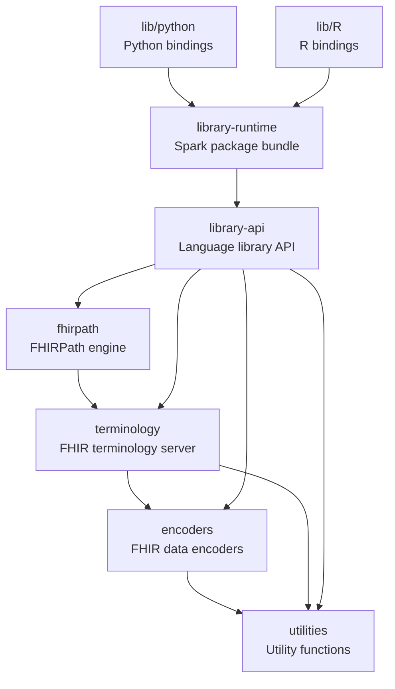

# How to contribute

Thanks for your interest in contributing to Pathling.

You can find out a bit more about Pathling by reading the [README](README.md)
file within this repository.

## Reporting issues

Issues can be used to:

* Report a defect
* Request a new feature or enhancement
* Ask a question

New issues will be automatically populated with a template that highlights the
information that needs to be submitted with an issue that describes a defect. If
the issue is not related to a defect, please just delete the template and
replace it with a detailed description of the problem you are trying to solve.

## Creating a pull request

Please communicate with us (preferably through creation of an issue) before
embarking on any significant work within a pull request. This will prevent
situations where people are working at cross-purposes.

Your branch should be named `issue/[GitHub issue #]`.

## Development dependencies

You will need the following software to build the solution:

* Java 21
* Maven 3.9+
* Python 3.9+
* uv (Python package manager)
* R 3.5+

To build and install locally, run:

```
mvn clean install
```

## Building and testing

This is a multi-module Maven project with inter-module dependencies. The
following
sections describe how to compile and test specific modules efficiently.

### Module compilation

#### Single module compilation

To compile just a specific module (if dependencies are already compiled):

```bash
mvn compile -pl <module-name>
```

Example:

```bash
mvn compile -pl library-api
```

#### Compile with dependencies

To compile a module and all its upstream dependencies:

```bash
mvn compile -pl <module-name> -am
```

Example:

```bash
mvn compile -pl library-api -am
```

This will compile `utilities`, `encoders`, `terminology`, `fhirpath`, and
`library-api` in the correct dependency order.

#### Clean compilation

For a fresh build from scratch:

```bash
mvn clean compile -pl <module-name> -am
```

To compile all modules:

```bash
mvn clean compile
```

### Running tests

#### Single module testing

If you are testing changes to a single module and don't need to recompile
dependencies:

```bash
mvn test -pl <module-name> -Dtest=<TestClassName>
```

Example:

```bash
mvn test -pl library-api -Dtest=DataSourcesTest
```

#### Testing with dependency compilation

If you know that code from module dependencies needs to be compiled, use the
`-am` (also make) flag with the failIfNoSpecifiedTests parameter:

```bash
mvn test -pl <module-name> -am -Dtest=<TestClassName> -Dsurefire.failIfNoSpecifiedTests=false
```

Example:

```bash
mvn test -pl library-api -am -Dtest=DataSourcesTest -Dsurefire.failIfNoSpecifiedTests=false
```

The `-Dsurefire.failIfNoSpecifiedTests=false` parameter prevents the build from
failing when upstream modules don't contain the specified test class.

#### Test pattern matching

You can also use patterns to run multiple test classes:

```bash
mvn test -pl library-api -Dtest="*DataSource*"
```

#### Full module test suite

To run all tests in a specific module:

```bash
mvn test -pl <module-name>
```

### Available modules

- `utilities`
- `encoders`
- `terminology`
- `fhirpath`
- `library-api`
- `library-runtime`
- `lib/python`
- `lib/R`
- `site`
- `benchmark`
- `server`

### Building and testing the server module

The `server` module is structured differently from other modules as it does not
have the main `pom.xml` as a parent. This means it must be built and tested
separately from the main Maven reactor.

#### Prerequisites

Before building the server, ensure that:

1. The server's `pom.xml` references the correct Pathling version
2. An up to date version of `library-runtime` is available in your local Maven
   repository

To install the required dependencies:

```bash
mvn clean install -pl library-runtime -am
```

#### Building the server

All server build and test commands must be run from inside the `server`
directory:

```bash
cd server
mvn clean install
```

#### Running tests

The server test suite includes both unit tests and integration tests:

```bash
cd server
mvn test                    # Run unit tests
mvn verify                  # Run unit and integration tests
```

To run specific tests:

```bash
cd server
mvn test -Dtest=ImportExecutorTest
mvn clean verify -Dit.test=ImportPnpOperationIT -Dtest=foo -Dsurefire.failIfNoSpecifiedTests=false
```

The last command runs only the specified integration test without running unit tests.
The `-Dtest=foo` parameter specifies a non-existent unit test pattern, and
`-Dsurefire.failIfNoSpecifiedTests=false` prevents failure when no unit tests
match.

#### Docker image

The server includes a `docker` profile for building and deploying Docker images.

To build a Docker image locally:

```bash
cd server
mvn clean install -Pdocker
```

To push the image to a remote registry:

```bash
cd server
mvn clean deploy -Pdocker
```

##### Configuring Docker repository and tag

You can customise the Docker repository and tag using Maven properties:

```bash
cd server
mvn clean install -Pdocker \
  -Dpathling.fhirServerDockerRepo=myregistry/pathling \
  -Dpathling.fhirServerDockerTag=v1.0.0
```

The default repository is `aehrc/pathling` and the default tag is `latest`.

##### Multi-architecture builds

The Docker build automatically creates multi-architecture images for both
`linux/amd64` and `linux/arm64` platforms. This is configured in the Jib
plugin and cannot be overridden via command-line properties.

### Testing Python and R libraries

The Python and R libraries depend on both JARs and generated files created by
the Maven build process. You **cannot** run tests using language-specific tools
(such as `pytest` or `devtools::test`), install the libraries in editable mode
(`pip install -e .`), or use them in any way without first building through
Maven to generate the required files.

To test the Python library:

```bash
mvn test -pl lib/python -am
```

To test the R library:

```bash
mvn test -pl lib/R -am
```

The `-am` flag ensures that all upstream dependencies are built before running
the tests.

#### First-time setup

Before working with the Python or R libraries, you must run a Maven build to
generate required files (such as `_version.py` for Python). For a complete
build:

```bash
mvn clean install -pl lib/python -am
```

or

```bash
mvn clean install -pl lib/R -am
```

After this initial build, you can install the Python library in editable mode
if needed:

```bash
cd lib/python
pip install -e .
```

#### Clearing the Ivy cache

When rebuilding after making changes to upstream modules, you may need to clear
the local Ivy cache before the changes will be picked up by the Python and R
libraries. The Ivy cache is typically located at `~/.ivy2/cache`.

To clear the cache:

```bash
rm -rf ~/.ivy2/cache
```

After clearing the cache, rebuild the libraries:

```bash
mvn clean install -pl lib/python -am
mvn clean install -pl lib/R -am
```

## Versioning and branching

All versioning
follows [Semantic Versioning 2.0.0](https://semver.org/spec/v2.0.0.html).

**Note on major version increments**: In addition to the standard semantic
versioning rules, Pathling will increment the major version number when moving
to a new major version of Apache Spark. This is because Spark major version
changes introduce potential incompatibilities to the environment on which
Pathling is designed to run, affecting deployment, dependencies, and runtime
requirements.

The core of Pathling consists of the following modules, all of which inherit
from the main `pom.xml` in the root of the repository.

- `utilities` - Utility functions used by different components of Pathling.
- `encoders` - Encoders for transforming [FHIR](https://hl7.org/fhir/) data into
  Spark Datasets.
- `terminology` - Interact with
  a [FHIR terminology server](https://hl7.org/fhir/terminology-service.html)
  from Spark.
- `fhirpath` - A library that can
  translate [FHIRPath expressions](https://hl7.org/fhirpath/) into Spark
  queries.
- `library-api` - An API that exposes Pathling functionality to language
  libraries.
- `library-runtime` - A Spark package that bundles the Pathling Library API and
  its runtime dependencies for cluster deployment.
- `lib/python` - Python language bindings for Pathling.
- `lib/R` - R language bindings for Pathling.



The "public API" of Pathling is defined as the public API of the library API
module.

Other modules are versioned independently of the library API, but should still
follow the principles of Semantic Versioning based upon their public,
user-facing interfaces.

The branching strategy is very simple and is based on
[GitHub Flow](https://guides.github.com/introduction/flow/). There are no
long-lived branches, all changes are made via pull requests and will be the
subject of an issue branch that is created from and targeting `main`.

We release frequently, and we will use a short-lived `release/`-prefixed branch
to aggregate more than one PR into a new version.

The POM versions of the core modules should be on a SNAPSHOT version when
developing on a release branch. Successful builds of the release branch
will be published to the Maven Central repository as SNAPSHOT versions.

Maven POM versions on `main` are always release versions. Builds are always
verified to be green within CI before merging to main. Merging to main
automatically triggers publishing of artifacts and deployment of the software to
production environments such as the Pathling website and sandbox instance.


## Commit Message Format

Write commit messages that capture the **objective** of the change, not the specific implementation details that can be obtained from the diff.

**Structure**:
```
<type>: <succinct description of the objective>

<optional body explaining the why and context>
```

**Types**:
- `fix:` - Bug fixes or resolving warnings/errors
- `feat:` - New features or enhancements
- `refactor:` - Code restructuring without changing behavior
- `docs:` - Documentation updates
- `test:` - Test-related changes
- `chore:` - Build, tooling, or dependency updates

**Guidelines**:
- Focus on **why** the change was needed and **what problem** it solves
- Avoid mentioning specific files, line numbers, or implementation details
- Keep the first line concise (under 72 characters when possible)
- Use the body to provide context if the objective isn't obvious

**Examples**:

Good:
```
fix: Suppress Mockito dynamic agent loading warnings in Java 21

Added JVM flag to suppress warnings about Mockito's inline mock maker
self-attaching. Updated documentation to record Maven test configuration.
```

Poor:
```
fix: Added -XX:+EnableDynamicAgentLoading to pom.xml line 637

Changed the argLine in maven-surefire-plugin configuration.
Updated CLAUDE.md with new section at lines 102-120.
```


## Coding conventions

### Comments

- All comments must use correct grammar and be written as complete sentences.
- Every comment, including single-line comments, must be terminated with a
  period.
- Comments should clearly explain the purpose or logic of the code they
  annotate.
- Avoid redundant comments that restate obvious code; focus on intent,
  rationale, or non-obvious behaviour.
- Update comments when code changes to keep them accurate and relevant.
- TODOs should not be present in code that is being submitted for review.
  If you have a task that you want to complete in the future, please create an
  issue for it.

### Java

- Use meaningful and descriptive names for classes, methods, and variables
  (avoid abbreviations).
- Follow standard Java naming conventions:
    - Classes and interfaces: PascalCase (e.g., `MyClass`)
    - Methods and variables: camelCase (e.g., `myVariable`, `calculateTotal`)
    - Constants: UPPER_SNAKE_CASE (e.g., `MAX_SIZE`)
- Keep methods short and focused on a single responsibility.
- Avoid code duplication; extract common logic into reusable methods.
- Always use braces `{}` for `if`, `else`, `for`, `while`, and `do` statements,
  even for single statements.
- Use `final` for variables, parameters, and methods that should not change.
- Avoid using magic numbers; define constants with meaningful names.
- Avoid the use of inner classes, records and enums - having each class defined
  in its own file is preferred and avoids any implicit dependencies on code
  within the enclosing scope.
- Document public classes and methods
  with [Javadoc comments](https://www.oracle.com/technical-resources/articles/java/javadoc-tool.html).
- Handle exceptions appropriately; do not use empty catch blocks.
- Close resources (e.g., streams, connections) in a `finally` block or use
  try-with-resources.
- Avoid deeply nested code; refactor to improve readability.
- Do not ignore method return values unless intentional and documented.
- Use logging frameworks instead of `System.out` or `System.err` for output.
- Remove unused code, imports, and variables.
- Write unit tests for all public methods and critical logic.
- Avoid hardcoding file paths, URLs, or credentials; use configuration files or
  environment variables.
- Use access modifiers (`private`, `protected`, `public`) appropriately to
  encapsulate data.
- Do not suppress warnings without a clear justification.
- Use nullability annotations (`jakarta.annotation.Nonnull` and
  `jakarta.annotation.Nullable`) on method parameters, return values, and class
  or record fields.
- Do not leave unused or commented-out code in the codebase.
- Ensure code is free of major bugs, vulnerabilities, and code smells as
  reported by SonarQube.

### Scala

- Use meaningful and descriptive names
  following [Scala conventions](https://docs.scala-lang.org/style/).
- Follow standard Scala naming conventions:
    - Classes and traits: PascalCase (e.g., `MyClass`)
    - Methods and variables: camelCase (e.g., `myVariable`, `calculateTotal`)
    - Constants: UPPER_SNAKE_CASE (e.g., `MAX_SIZE`)
- Prefer immutable data structures and functional programming patterns.
- Use `val` instead of `var` whenever possible.
- Leverage pattern matching instead of complex conditional statements.
- Use case classes for data containers.
- Handle errors with `Option`, `Either`, or `Try` instead of exceptions where
  appropriate.
- Use appropriate collection methods (`map`, `filter`, `fold`) instead of loops.
- Keep methods short and focused on a single responsibility.

### Python

- Follow [PEP 8](https://peps.python.org/pep-0008/) style guidelines.
- Use meaningful and descriptive names with snake_case convention.
- Use type hints for function parameters and return values.
- Use docstrings for all public functions, classes, and modules.
- Prefer list comprehensions over loops where appropriate.
- Use context managers (`with` statements) for resource management.
- Handle exceptions explicitly; avoid bare `except` clauses.
- Write unit tests using [pytest framework](https://pytest.org/).
- Keep imports organized: standard library, third-party, local imports.

### R

- Follow [tidyverse style guide](https://style.tidyverse.org/) conventions.
- Use snake_case for variable and function names.
- Use meaningful and descriptive names.
- Prefer vectorized operations over loops.
- Use the pipe operator (`%>%` or `|>`) for readable data transformations.
- Use appropriate data structures (data.frames, tibbles, lists).
- Document functions with roxygen2 comments.
- Use testthat for unit testing.
- Handle missing values (`NA`) appropriately.
- Use consistent indentation (2 spaces recommended).

### Formatting

This repository uses multiple code formatters:

- [Prettier](https://prettier.io/) for JavaScript/TypeScript code, JSON and YAML
- [Ruff](https://docs.astral.sh/ruff/) for Python code
- [EditorConfig](https://editorconfig.org/) for all other languages

Please use the appropriate formatter to reformat your code before pushing.

## Code of conduct

Before making a contribution, please read the
[code of conduct](CODE_OF_CONDUCT.md).
