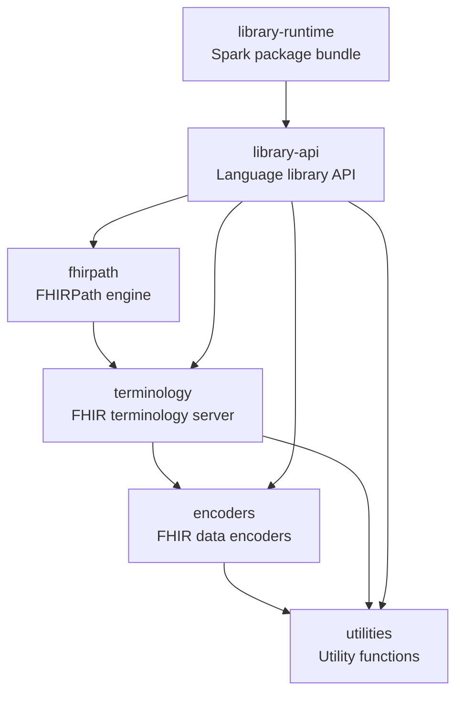

# How to contribute

Thanks for your interest in contributing to Pathling.

You can find out a bit more about Pathling by reading the [README](README.md)
file within this repository.

## Reporting issues

Issues can be used to:

* Report a defect
* Request a new feature or enhancement
* Ask a question

New issues will be automatically populated with a template that highlights the
information that needs to be submitted with an issue that describes a defect. If
the issue is not related to a defect, please just delete the template and
replace it with a detailed description of the problem you are trying to solve.

## Creating a pull request

Please communicate with us (preferably through creation of an issue) before
embarking on any significant work within a pull request. This will prevent
situations where people are working at cross-purposes.

Your branch should be named `issue/[GitHub issue #]`.

## Development dependencies

You will need the following software to build the solution:

* Java 17
* Maven 3+
* Python 3.8+
* R 3.5+

To build and install locally, run:

```
mvn clean install
```

## Versioning and branching

All versioning
follows [Semantic Versioning 2.0.0](https://semver.org/spec/v2.0.0.html).

The core of Pathling consists of the following modules, all of which inherit
from the main `pom.xml` in the root of the repository.

- `utilities` - Utility functions used by different components of Pathling.
- `encoders` - Encoders for transforming FHIR data into Spark Datasets.
- `terminology` - Interact with a FHIR terminology server from Spark.
- `fhirpath` - A library that can translate FHIRPath expressions into Spark queries.
- `library-api` - An API that exposes Pathling functionality to language libraries.
- `library-runtime` - A Spark package that bundles the Pathling Library API and its runtime dependencies for cluster deployment.



The "public API" of Pathling is defined as the public API of the library API
module.

Other modules are versioned independently of the library API, but should still
follow the principles of Semantic Versioning based upon their public,
user-facing interfaces.

The branching strategy is very simple and is based on
[GitHub Flow](https://guides.github.com/introduction/flow/). There are no
long-lived branches, all changes are made via pull requests and will be the
subject of an issue branch that is created from and targeting `main`.

We release frequently, and we will use a short-lived `release/`-prefixed branch
to aggregate more than one PR into a new version.

The POM versions of the core modules should be on a SNAPSHOT version when
developing on a release branch. Successful builds of the release branch
will be published to the Maven Central repository as SNAPSHOT versions.

Maven POM versions on `main` are always release versions. Builds are always
verified to be green within CI before merging to main. Merging to main
automatically triggers publishing of artifacts and deployment of the software to
production environments such as the Pathling website and sandbox instance.

### Coding conventions

#### Comments

- All comments must use correct grammar and be written as complete sentences.
- Every comment, including single-line comments, must be terminated with a
  period.
- Comments should clearly explain the purpose or logic of the code they
  annotate.
- Avoid redundant comments that restate obvious code; focus on intent,
  rationale, or non-obvious behaviour.
- Update comments when code changes to keep them accurate and relevant.
- TODOs should not be present in code that is being submitted for review.
  If you have a task that you want to complete in the future, please create an
  issue for it.

#### Java

- Use meaningful and descriptive names for classes, methods, and variables
  (avoid abbreviations).
- Follow standard Java naming conventions:
    - Classes and interfaces: PascalCase (e.g., `MyClass`)
    - Methods and variables: camelCase (e.g., `myVariable`, `calculateTotal`)
    - Constants: UPPER_SNAKE_CASE (e.g., `MAX_SIZE`)
- Keep methods short and focused on a single responsibility.
- Avoid code duplication; extract common logic into reusable methods.
- Always use braces `{}` for `if`, `else`, `for`, `while`, and `do` statements,
  even for single statements.
- Use `final` for variables, parameters, and methods that should not change.
- Avoid using magic numbers; define constants with meaningful names.
- Document public classes and methods with Javadoc comments.
- Handle exceptions appropriately; do not use empty catch blocks.
- Close resources (e.g., streams, connections) in a `finally` block or use
  try-with-resources.
- Avoid deeply nested code; refactor to improve readability.
- Do not ignore method return values unless intentional and documented.
- Use logging frameworks instead of `System.out` or `System.err` for output.
- Remove unused code, imports, and variables.
- Write unit tests for all public methods and critical logic.
- Avoid hardcoding file paths, URLs, or credentials; use configuration files or
  environment variables.
- Use access modifiers (`private`, `protected`, `public`) appropriately to
  encapsulate data.
- Do not suppress warnings without a clear justification.
- Use nullability annotations (`jakarta.annotation.Nonnull` and
  `jakarta.annotation.Nullable`) on method parameters, return values, and class
  or record fields.
- Do not leave unused or commented-out code in the codebase.
- Ensure code is free of major bugs, vulnerabilities, and code smells as
  reported by SonarQube.

#### Scala

- Use meaningful and descriptive names following Scala conventions.
- Follow standard Scala naming conventions:
    - Classes and traits: PascalCase (e.g., `MyClass`)
    - Methods and variables: camelCase (e.g., `myVariable`, `calculateTotal`)
    - Constants: UPPER_SNAKE_CASE (e.g., `MAX_SIZE`)
- Prefer immutable data structures and functional programming patterns.
- Use `val` instead of `var` whenever possible.
- Leverage pattern matching instead of complex conditional statements.
- Use case classes for data containers.
- Handle errors with `Option`, `Either`, or `Try` instead of exceptions where
  appropriate.
- Use appropriate collection methods (`map`, `filter`, `fold`) instead of loops.
- Keep methods short and focused on a single responsibility.

#### Python

- Follow PEP 8 style guidelines.
- Use meaningful and descriptive names with snake_case convention.
- Use type hints for function parameters and return values.
- Use docstrings for all public functions, classes, and modules.
- Prefer list comprehensions over loops where appropriate.
- Use context managers (`with` statements) for resource management.
- Handle exceptions explicitly; avoid bare `except` clauses.
- Write unit tests using pytest framework.
- Keep imports organized: standard library, third-party, local imports.

#### R

- Follow tidyverse style guide conventions.
- Use snake_case for variable and function names.
- Use meaningful and descriptive names.
- Prefer vectorized operations over loops.
- Use the pipe operator (`%>%` or `|>`) for readable data transformations.
- Use appropriate data structures (data.frames, tibbles, lists).
- Document functions with roxygen2 comments.
- Use testthat for unit testing.
- Handle missing values (`NA`) appropriately.
- Use consistent indentation (2 spaces recommended).

#### Formatting

This repository uses multiple code formatters:

- Prettier for JavaScript/TypeScript code
- Ruff for Python code
- EditorConfig for all other languages

Please use the appropriate formatter to reformat your code before pushing.

## Code of conduct

Before making a contribution, please read the
[code of conduct](CODE_OF_CONDUCT.md).
