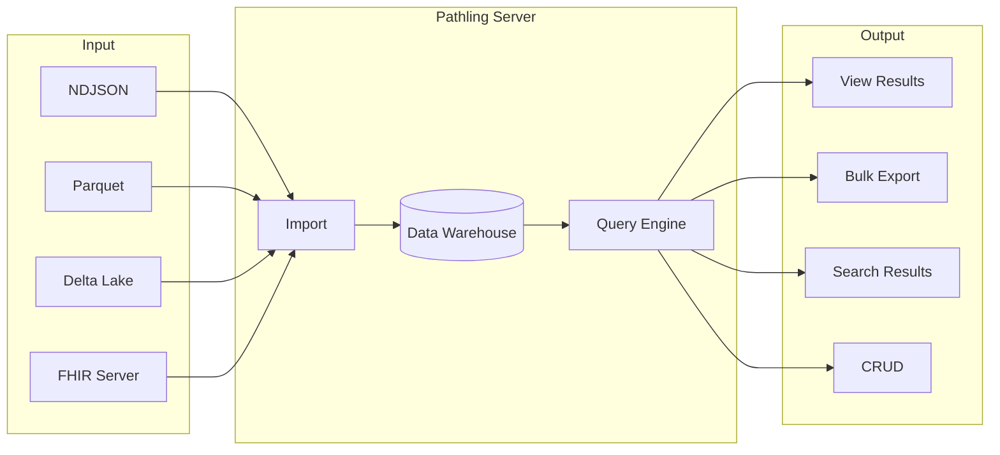

# Pathling Server

Pathling Server is a FHIR R4 analytics server that exposes a range of
functionality for use by applications.



## Features

- **SQL on FHIR**: Run view definitions to preview tabular projections of FHIR
  data, then export to NDJSON, CSV, or Parquet
- **Bulk Data Access**: Export data at system, patient, or group level using the
  FHIR Bulk Data Access specification
- **Bulk Import**: Import data from NDJSON, Parquet, or Delta Lake sources, or
  sync with another FHIR server that supports bulk export
- **Bulk Submit**: An experimental implementation of the Bulk Submit proposal
- **FHIRPath Search**: Query resources using FHIRPath expressions
- **CRUD Operations**: Create, read, update, and delete resources

## Getting started

The server is distributed as a Docker image. To run a basic instance:

```bash
docker run -p 8080:8080 ghcr.io/aehrc/pathling:latest
```

The server will be available at `http://localhost:8080/fhir`. An admin UI is
available at `http://localhost:8080/admin/`.

For production deployments, see:

- [Configuration](https://pathling.csiro.au/docs/server/configuration) -
  Environment variables and server settings
- [Kubernetes deployment](https://pathling.csiro.au/docs/server/deployment/kubernetes) -
  Scaling and clustering options

## Configuration

The server can be configured via environment variables. Key configuration areas
include:

- **Storage**: Data warehouse location (local filesystem, S3, or other
  Hadoop-compatible storage)
- **Authentication**: OAuth2/OIDC-based authorisation using SMART on FHIR
- **Operations**: Enable or disable specific FHIR operations
- **Spark**: Apache Spark cluster configuration for distributed processing

See the [configuration documentation](https://pathling.csiro.au/docs/server/configuration)
for full details.

## Development

For build, test, and deployment instructions, see [CONTRIBUTING.md](CONTRIBUTING.md).

For coding conventions and contribution guidelines, see the
[main CONTRIBUTING.md](../CONTRIBUTING.md) in the repository root.

## Documentation

Full documentation is available at [pathling.csiro.au](https://pathling.csiro.au/docs/server).

## Licence

Copyright © 2018-2026 Commonwealth Scientific and Industrial Research
Organisation (CSIRO) ABN 41 687 119 230.

Licensed under the Apache License, Version 2.0. See [LICENSE](../LICENSE) for
details.
