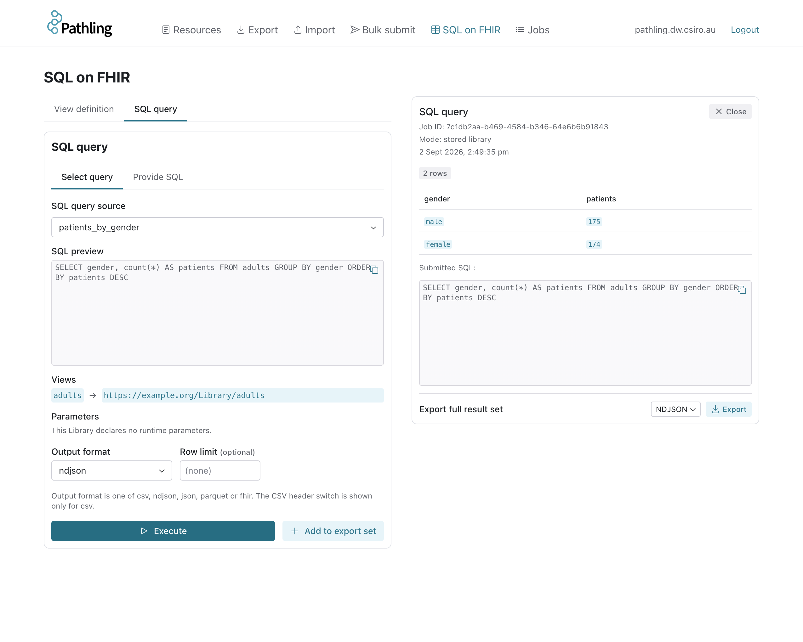
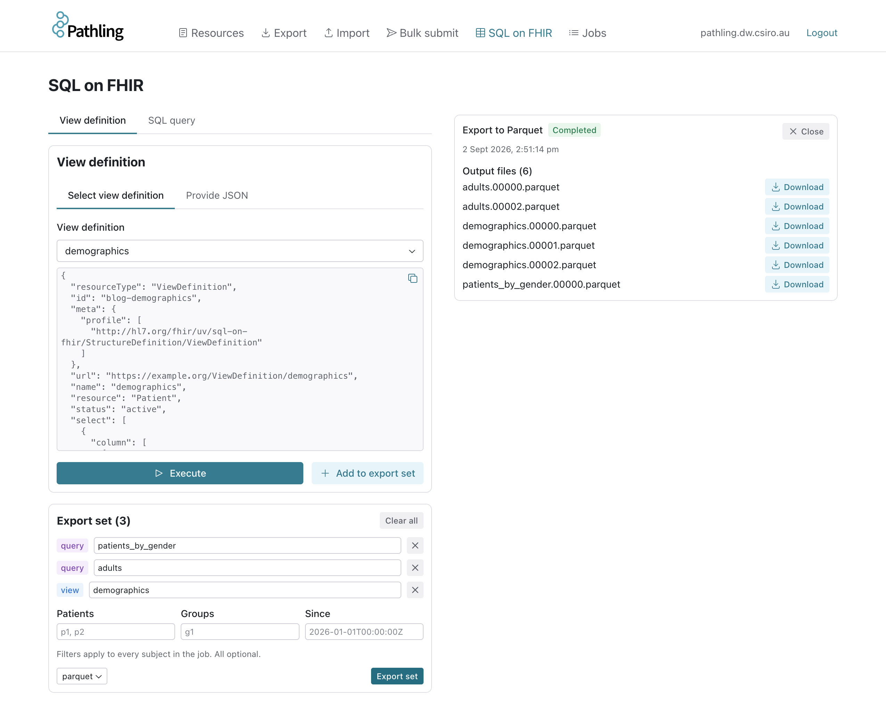
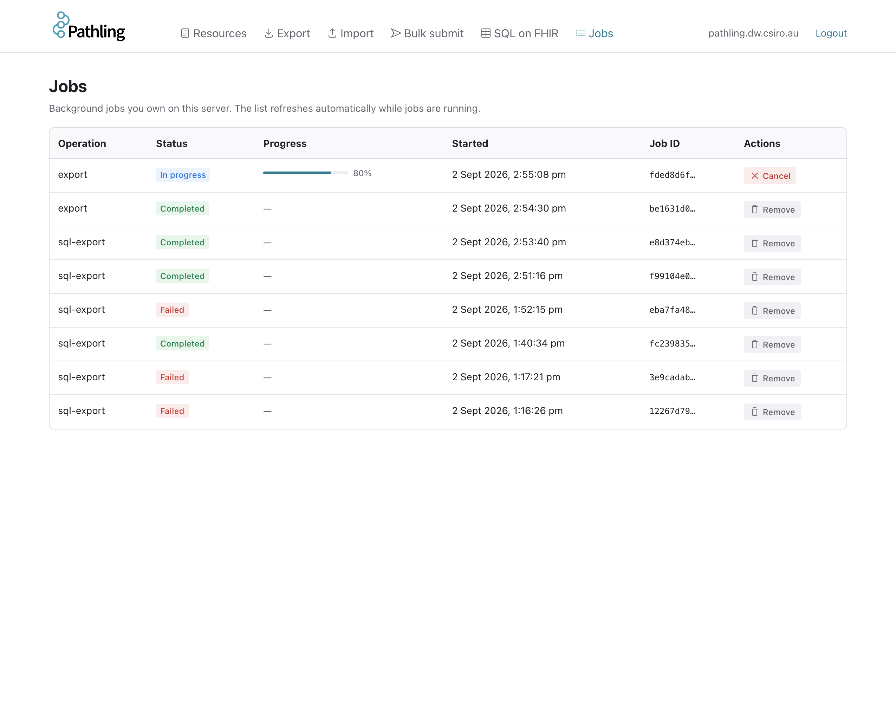

Pathling server 3.0.0 is now available. It lets you build SQL queries out of
other SQL queries, export a set of related views and queries as one consistent
snapshot, and monitor every asynchronous job on the server from a single place.
It also aligns the server with the operations balloted in version 3.0.0 of the
[SQL on FHIR](https://sql-on-fhir.org/) specification.

<!-- truncate -->

## Reuse SQL across queries

In 2.x, a SQL query could read from ViewDefinitions but not from other queries.
Logic that several queries shared, such as a cohort filter or a derived
column, had to be repeated in each one. Server 3.0.0 adds
[SQLView](https://build.fhir.org/ig/HL7/sql-on-fhir/StructureDefinition-SQLView.html)
Libraries: named SQL table sources that can be read by queries and by other
views. Common logic is written once, stored on the server and referenced by
canonical URL.

Suppose the `demographics` ViewDefinition below is stored with the canonical URL
`https://example.org/ViewDefinition/demographics`:

```json
{
    "resourceType": "ViewDefinition",
    "url": "https://example.org/ViewDefinition/demographics",
    "name": "demographics",
    "resource": "Patient",
    "status": "active",
    "select": [
        {
            "column": [
                { "name": "id", "path": "id" },
                { "name": "family", "path": "name.first().family" },
                { "name": "gender", "path": "gender" },
                { "name": "birth_date", "path": "birthDate" }
            ]
        }
    ]
}
```

A SQLView can define an adult cohort over it:

```json
{
    "resourceType": "Library",
    "url": "https://example.org/Library/adults",
    "name": "adults",
    "status": "active",
    "type": {
        "coding": [
            {
                "system": "https://sql-on-fhir.org/ig/CodeSystem/LibraryTypesCodes",
                "code": "sql-view"
            }
        ]
    },
    "relatedArtifact": [
        {
            "type": "depends-on",
            "label": "demographics",
            "resource": "https://example.org/ViewDefinition/demographics"
        }
    ],
    "content": [
        {
            "contentType": "application/sql",
            "data": "U0VMRUNUIGlkLCBnZW5kZXIsIGJpcnRoX2RhdGUgRlJPTSBkZW1vZ3JhcGhpY3MgV0hFUkUgYmlydGhfZGF0ZSA8PSAnMjAwOC0wOS0wMic="
        }
    ]
}
```

The `data` is the Base64 encoding of
`SELECT id, gender, birth_date FROM demographics WHERE birth_date <= '2008-09-02'`.
Any number of queries can then build on `adults` without restating the cohort
definition. This
[SQLQuery](https://build.fhir.org/ig/HL7/sql-on-fhir/StructureDefinition-SQLQuery.html)
counts the cohort by gender:

```json
{
    "resourceType": "Library",
    "url": "https://example.org/Library/patients-by-gender",
    "name": "patients_by_gender",
    "status": "active",
    "type": {
        "coding": [
            {
                "system": "https://sql-on-fhir.org/ig/CodeSystem/LibraryTypesCodes",
                "code": "sql-query"
            }
        ]
    },
    "relatedArtifact": [
        {
            "type": "depends-on",
            "label": "adults",
            "resource": "https://example.org/Library/adults"
        }
    ],
    "content": [
        {
            "contentType": "application/sql",
            "data": "U0VMRUNUIGdlbmRlciwgY291bnQoKikgQVMgcGF0aWVudHMgRlJPTSBhZHVsdHMgR1JPVVAgQlkgZ2VuZGVy"
        }
    ]
}
```

That query is `SELECT gender, count(*) AS patients FROM adults GROUP BY gender`.
Run it by reference and the server resolves the chain `patients_by_gender` ->
`adults` -> `demographics` on your behalf:

```bash
curl 'http://localhost:8080/fhir/$sql-run?subjectReference=Library/patients-by-gender&_format=csv'
```

```
gender,patients
female,412
male,388
```

If the definition of `adults` changes, every query that depends on it picks up
the change on its next run. The server resolves each artefact in the graph once,
rejects cycles, and refuses graphs nested deeper than
`pathling.sqlQuery.maxDependencyDepth` (default 10) before doing any work.
Artefacts that are not stored on the server can be passed inline through the
`context` parameter, so the same composition works for ad hoc exploration.

The admin UI resolves the same chain. Selecting a stored query shows its SQL,
the views it reads and the parameters it declares, before running it:



## Export related tables as one consistent snapshot

Analytical outputs rarely stand alone. A research extract might need a patient
table, a conditions table and a medications table that agree with one another;
a dashboard might need a dozen summary queries computed from the same data. In
2.x each of those was a separate export, and data written between them could
leave the outputs inconsistent.

The new `$sql-export` operation carries any number of subjects in one job, in
any mixture of ViewDefinitions, SQLQueries and SQLViews. Every subject reads the
Delta table versions pinned when the job began, so a write that lands while the
job is running is invisible to all of them. The request is validated in full
before the job starts, and one completion manifest lists one output per subject.

```bash
curl -X POST 'http://localhost:8080/fhir/$sql-export' \
  -H 'Content-Type: application/fhir+json' \
  -H 'Prefer: respond-async' \
  -d '{
    "resourceType": "Parameters",
    "parameter": [
      {
        "name": "subject",
        "part": [
          { "name": "name", "valueString": "demographics" },
          {
            "name": "subjectCanonical",
            "valueCanonical": "https://example.org/ViewDefinition/demographics"
          }
        ]
      },
      {
        "name": "subject",
        "part": [
          { "name": "name", "valueString": "adults" },
          {
            "name": "subjectCanonical",
            "valueCanonical": "https://example.org/Library/adults"
          }
        ]
      },
      {
        "name": "subject",
        "part": [
          { "name": "name", "valueString": "patients_by_gender" },
          {
            "name": "subjectReference",
            "valueReference": { "reference": "Library/patients-by-gender" }
          }
        ]
      },
      { "name": "_format", "valueCode": "parquet" }
    ]
  }'
```

The server returns `202 Accepted` with a `Content-Location` status URL. When the
job completes, polling it redirects to a manifest naming a download location
for each of the three outputs. Output formats are `ndjson`, `csv` and `parquet`.
The `patient`, `group` and `_since` parameters apply to every subject in the
job, so a cohort or an incremental window can be applied to the whole set at
once.

Because a shared dependency such as `demographics` is resolved once per job
rather than once per subject, exporting a family of related queries costs less
than exporting them separately.

In the admin UI, views and queries are added to an export set, each with the
name its output will take, and the whole set is exported in one job:



Read the docs: [export](/docs/server/operations/sql-export).

## Monitor jobs across the server

Import, export and SQL export all run asynchronously, and until now the only
handle on a running job was the status URL returned when it started. Lose that
response and there was no way to find the job again.

The new `$jobs` operation lists the asynchronous jobs held by the server, with
the operation that started each one, its derived status and progress, and the
URL to poll or cancel it:

```bash
curl 'http://localhost:8080/fhir/$jobs'
```

```json
{
    "resourceType": "Parameters",
    "parameter": [
        {
            "name": "job",
            "part": [
                { "name": "id", "valueString": "7f3a9c1e-..." },
                { "name": "operation", "valueCode": "sql-export" },
                { "name": "status", "valueCode": "in-progress" },
                { "name": "progress", "valueInteger": 62 },
                { "name": "startTime", "valueInstant": "2026-09-02T00:42:11Z" },
                {
                    "name": "url",
                    "valueUri": "http://localhost:8080/fhir/$job?id=7f3a9c1e-..."
                }
            ]
        }
    ]
}
```

Visibility is governed by authorisation. When it is enabled, the caller must
hold the `pathling:jobs` authority, and sees only the jobs started under their
own token subject; a job can likewise only be cancelled by the principal that
created it. When authorisation is disabled, the list covers every job on the
server. The admin UI has a corresponding jobs page, so an operator can see what
is running and cancel a runaway query without touching the API.



Read the docs: [jobs](/docs/server/operations/jobs).

## Alignment with the SQL on FHIR ballot

Server 2.x implemented the operations from the SQL on FHIR continuous build at
the time: `$viewdefinition-run`, `$viewdefinition-export` and `$sqlquery-run`.
Ahead of the HL7 ballot of version 3.0.0, the specification consolidated those
into two operations,
[`$sql-run`](https://build.fhir.org/ig/HL7/sql-on-fhir/OperationDefinition-SQLRun.html)
and
[`$sql-export`](https://build.fhir.org/ig/HL7/sql-on-fhir/OperationDefinition-SQLExport.html),
each accepting a ViewDefinition, SQLQuery or SQLView as its subject. Server
3.0.0 implements the two balloted operations and removes the three they
replace. The CapabilityStatement advertises the specification's canonical
operation definitions.

`$sql-run` is the synchronous counterpart to `$sql-export`. A stored subject can
be run with a plain `GET`, as in the cohort example above, or an inline subject
posted as a `Parameters` resource. Both operations report every problem in a
request in a single `OperationOutcome`, so a malformed request can be corrected
in one round trip.

Read the docs: [run](/docs/server/operations/sql-run).

## Other changes

- With `pathling.storage.schemaAutoMerge` enabled, every table whose schema has
  drifted from the running encoders is migrated at startup and the in-memory
  dataset refreshed, so reads observe the new schema without a restart.
- `pathling.auth.tokenSigningAlgorithms` pins the accepted JWS algorithms.
  Left empty, they are derived from the issuer's JWKS at verification time, so
  key rotation at the identity provider takes effect without a restart.
- `spark-hadoop-cloud` is bundled, enabling the S3A magic committer for S3
  warehouses, and asynchronous exports no longer fail with `Wrong FS` on
  warehouses that are not on the default filesystem.
- The Helm chart accepts additional trusted CA certificates and grants the
  driver the RBAC permissions it needs to manage executor scratch volumes.
- SQL queries accept window functions and named windows, and `DESCRIBE` of a
  referenced view for schema introspection.

## Upgrading from 2.x

The following changes need attention before deploying 3.0.0 over a 2.x
installation:

| 2.x                                                             | 3.0.0                                                         |
| --------------------------------------------------------------- | ------------------------------------------------------------- |
| `$viewdefinition-run`, `$sqlquery-run`                          | `$sql-run`                                                    |
| `$viewdefinition-export`                                        | `$sql-export`                                                 |
| `pathling.operations.viewDefinitionRunEnabled`                  | `pathling.operations.sqlRunEnabled`                           |
| `pathling.operations.viewDefinitionInstanceRunEnabled`          | removed; use `$sql-run` with `subjectReference`               |
| `pathling.operations.viewDefinitionExportEnabled`               | `pathling.operations.sqlExportEnabled`                        |
| `pathling:view-run` authority                                   | `pathling:sql-run`                                            |
| `pathling:view-export` authority                                | `pathling:sql-export`                                         |
| `pathling.sqlQuery.maxRows`, `pathling.sqlQuery.timeoutSeconds` | removed; bound queries at the request or infrastructure level |

Two further authorisation changes apply when `pathling.auth.enabled` is `true`:

- Reading a resource by id now requires the `pathling:read-resource` operation
  authority in addition to read access for the type. A token holding only
  `pathling:read` no longer authorises the read interaction.
- Running a stored subject requires read access to the type it is stored as:
  `ViewDefinition` for a view, `Library` for a SQLQuery or SQLView. Subjects
  supplied inline in the request are exempt.

The full list of changes, bug fixes and dependency updates is in the
[release notes](https://github.com/aehrc/pathling/releases/tag/server-v3.0.0).
The documentation for 2.0.1 remains available under
[/docs/server/2.0.1](/docs/server/2.0.1/).

## Getting started

```bash
docker run -p 8080:8080 ghcr.io/aehrc/pathling:3
```

The FHIR API is at `http://localhost:8080/fhir` and the admin UI at
`http://localhost:8080/admin/`. For Kubernetes, use the
[Helm chart](https://artifacthub.io/packages/helm/pathling/pathling). See the
[server documentation](/docs/server) for configuration and operation details.
