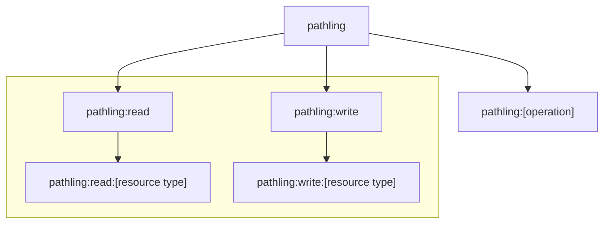

# Authorization

Pathling can perform the role of a resource server within the
[OpenID Connect framework](https://openid.net/connect/).

When authorization is enabled through configuration, Pathling will refuse any
requests which are not accompanied by a valid
[bearer token](https://tools.ietf.org/html/rfc6750). The following requirements
must be met:

- Token is a [JSON Web Token](https://tools.ietf.org/html/rfc7519)
- Token contains an
  [audience claim](https://tools.ietf.org/html/rfc7519#section-4.1.3) that
  matches the configured value
- Token contains
  an [issuer claim](https://tools.ietf.org/html/rfc7519#section-4.1.1)
  that matches the configured value
- Issuer provides
  an [OpenID Connect Discovery endpoint](https://openid.net/specs/openid-connect-discovery-1_0.html)
  that provides information about how to validate the token, including a link to
  a
  [JSON Web Key Set](https://tools.ietf.org/html/rfc7517) containing the signing
  key. This endpoint needs to be accessible to the Pathling server.

## Authorities

Pathling supports a set of authorities that control access to resources and
operations. Authorities must be provided within the `authorities` claim within
the JWT bearer token provided with each request.

→ includes

| Authority                        | Description                                                                     |
| -------------------------------- | ------------------------------------------------------------------------------- |
| `pathling`                       | Provides access to all operations and resources, implies all other authorities. |
| `pathling:read`                  | Provides read access to all resource types.                                     |
| `pathling:read:[resource type]`  | Provides read access to only a specified resource type.                         |
| `pathling:write`                 | Provides write access to all resource types.                                    |
| `pathling:write:[resource type]` | Provides write access to only a specified resource type.                        |
| `pathling:import`                | Provides access to the import operation.                                        |
| `pathling:import-pnp`            | Provides access to the ping and pull import operation.                          |
| `pathling:search`                | Provides access to the search operation.                                        |
| `pathling:update`                | Provides access to the update operation.                                        |
| `pathling:delete`                | Provides access to the delete operation.                                        |
| `pathling:batch`                 | Provides access to the batch operation.                                         |
| `pathling:bulk-submit`           | Provides access to the bulk submit operation.                                   |
| `pathling:export`                | Provides access to the export operation.                                        |
| `pathling:view-run`              | Provides access to the $viewdefinition-run operation.                           |
| `pathling:view-export`           | Provides access to the $viewdefinition-export operation.                        |

In order to enable access to an operation, an operation authority (e.g.
`pathling:search`) must be provided along with a `read` or `write` authority
(e.g. `pathling:read:Patient`).

Where expressions within a request reference multiple different resource types
(e.g. through resource references), authority for read access to all those
resources must be present within the token.

The import, delete, and batch operations require `write` authority for all
resource types that are referenced within the request.

The view operations (`view-run` and `view-export`) require `read` authority for
the resource type specified in the ViewDefinition's `resource` element. For
example, a ViewDefinition targeting `Patient` resources requires
`pathling:read:Patient` authority in addition to the operation authority.

## SMART configuration

When authorisation is enabled, Pathling exposes a
[SMART configuration document](https://hl7.org/fhir/smart-app-launch/conformance.html)
at `/.well-known/smart-configuration`. This document advertises the OAuth
endpoints and capabilities supported by the server.

Pathling automatically fetches and merges the issuer's OIDC discovery document
from `{issuer}/.well-known/openid-configuration`. Fields from the OIDC discovery
document are included in the SMART configuration response, with SMART-specific
fields taking precedence. This provides clients with comprehensive metadata
about supported scopes, response types, and other OAuth capabilities without
requiring explicit configuration.

The following fields can be configured explicitly and will override any values
from the OIDC discovery document:

- `authorization_endpoint` (via `pathling.auth.authUrl`)
- `token_endpoint` (via `pathling.auth.tokenUrl`)
- `revocation_endpoint` (via `pathling.auth.revokeUrl`)
- `capabilities` (via `pathling.auth.capabilities`)
- `grant_types_supported` (via `pathling.auth.grantTypesSupported`)
- `code_challenge_methods_supported` (via
  `pathling.auth.codeChallengeMethodsSupported`)
