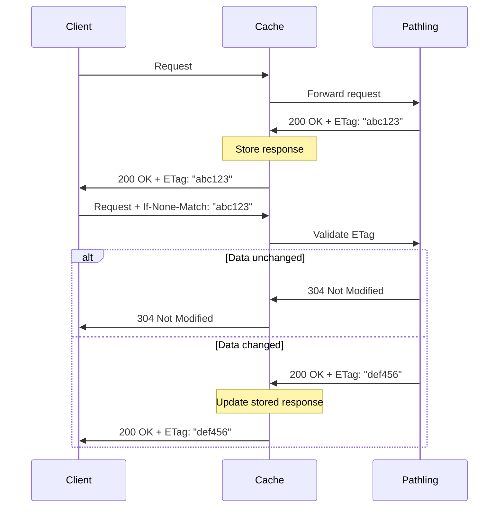

# Caching

Pathling implements
[ETag](https://developer.mozilla.org/en-US/docs/Web/HTTP/Headers/ETag)-based
cache validation, which enables clients to skip processing of queries when the
underlying data has not changed.

To use ETags, simply take the content of the `ETag` header that is returned with
a Pathling response. You can then accompany a subsequent request with the
[If-None-Match](https://developer.mozilla.org/en-US/docs/Web/HTTP/Headers/If-None-Match),
using the previously received ETag as the value. If the result of the query
would not have changed, Pathling will respond
with [304 Not Modified](https://developer.mozilla.org/en-US/docs/Web/HTTP/Status/304),
and will skip re-processing of the query.



Web browsers already implement this behaviour, and if your application runs in
the browser you will get the benefits without any extra implementation effort.

The current limitation of this implementation within Pathling is that caching is
done over the entire database, not scoped to individual resource types. This
means that updates to any resource will invalidate the cache for the entire
database.

Cache keys persist across restarts of the server, as they are derived from state
that is persisted along with the data.

## Intermediate caching

For production deployments, an intermediate HTTP cache can significantly improve
performance by storing responses closer to clients and reducing load on the
Pathling server. Pathling provides a ready-to-use
[Varnish](https://varnish-cache.org/) configuration in the
[deployment/cache](https://github.com/aehrc/pathling/tree/main/deployment/cache)
directory.

The Varnish configuration:

- Forwards requests to the Pathling backend
- Respects `Cache-Control` headers (passes through `no-cache`, `no-store`, and
  `private` responses)
- Stores cacheable responses with ETag-based revalidation
- Compresses responses with gzip

To use it, set the following environment variables:

- `PATHLING_HOST`: The hostname of the Pathling server
- `PATHLING_PORT`: The port number exposed by the Pathling server

A [Helm chart](https://artifacthub.io/packages/helm/pathling/pathling-cache) is also provided for Kubernetes deployments.

## Asynchronous endpoint caching

The `$job` and `$result` endpoints use a different caching strategy from other
Pathling endpoints. Instead of ETag-based revalidation, these endpoints use
simple TTL-based caching with `Cache-Control: max-age=X`.

This approach ensures that:

- Polling the `$job` endpoint returns fresh job status without stale cached
  responses from previous jobs
- Download URLs from `$result` remain cacheable for an appropriate duration

### How async operations determine request equivalence

When an async operation (such as `$export`) is initiated, Pathling constructs a
cache key from the following components:

1. **Request URL** - The complete URL including all query parameters
2. **Salient headers** - Headers from the `Vary` list, excluding those in
   `pathling.async.varyHeadersExcludedFromCacheKey` (default: `Accept`,
   `Accept-Encoding`)
3. **Database state** - A hash of the current database state
4. **Operation-specific parameters** - For operations that support POST with a
   request body, parameters from the body are included

If two requests produce the same cache key, they are considered equivalent and
will share the same async job. This allows multiple clients making identical
requests to receive results from the same job, improving efficiency.

The `varyHeadersExcludedFromCacheKey` setting allows you to exclude headers that
don't affect the result (like `Accept-Encoding`) from the cache key, so that
requests differing only in these headers will still share jobs.

### Server restart handling

Async jobs are stored in memory and are lost when the server restarts. To
prevent clients from polling stale job IDs from cached 202 responses, Pathling
includes a server instance identifier in the ETag of async responses.

Each server instance generates a unique ID at startup. The 202 Accepted response
for an async operation includes an ETag with a compact format:

```
W/"~{instanceId}.{hash}"
```

The `~` prefix identifies async ETags, `{instanceId}` is the 8-character server
instance ID, and `{hash}` is an 8-character truncated SHA-256 hash of the job
ID. This format keeps ETags short while avoiding exposure of the full job UUID.

When the server restarts:

1. A new instance ID is generated
2. Clients with cached 202 responses send `If-None-Match` with the old ETag
3. The server detects the mismatched instance ID and returns a fresh response
   with a new job ID, rather than 304 Not Modified

This ensures clients always receive valid job IDs, even when using cached
responses from before a server restart.

### Configuring cache duration

The cache duration is controlled by `pathling.async.cacheMaxAge` (default: 1
second). This value should be aligned with your job file retention strategy:

- **S3 lifecycle policies**: If you configure S3 to delete job files after 24
  hours, set `cacheMaxAge` to `86400` (24 hours) or less
- **Manual cleanup**: Match the cache duration to your cleanup schedule
- **No cleanup**: Use a longer duration to maximise cache efficiency

Example configuration for 24-hour retention:

```yaml
pathling:
    async:
        cacheMaxAge: 86400
```

When using an intermediate cache like Varnish, the cache will serve responses
until the TTL expires, then fetch fresh responses from Pathling. This avoids
the revalidation issues that can occur with ETag-based caching for async
operations.
