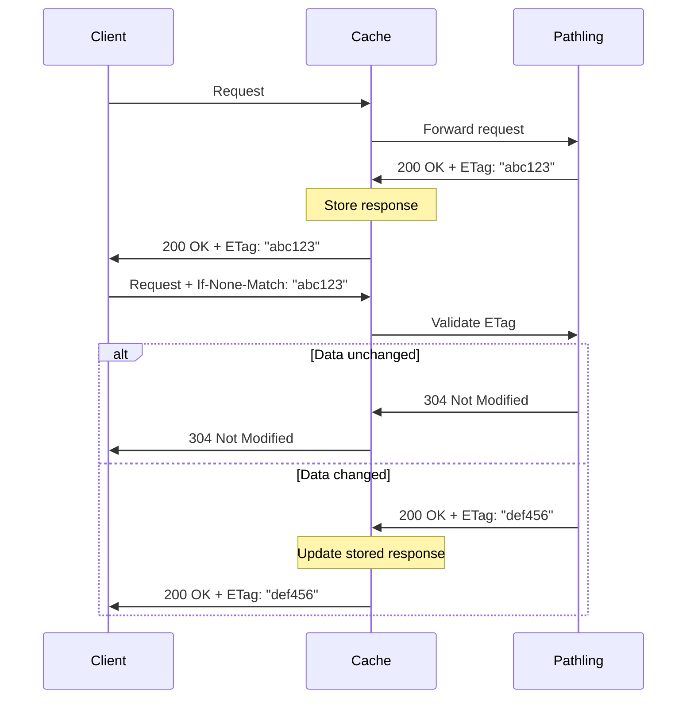

# Caching

Pathling implements
[ETag](https://developer.mozilla.org/en-US/docs/Web/HTTP/Headers/ETag)-based
cache validation, which enables clients to skip processing of queries when the
underlying data has not changed.

To use ETags, simply take the content of the `ETag` header that is returned with
a Pathling response. You can then accompany a subsequent request with the
[If-None-Match](https://developer.mozilla.org/en-US/docs/Web/HTTP/Headers/If-None-Match),
using the previously received ETag as the value. If the result of the query
would not have changed, Pathling will respond
with [304 Not Modified](https://developer.mozilla.org/en-US/docs/Web/HTTP/Status/304),
and will skip re-processing of the query.

Web browsers already implement this behaviour, and if your application runs in
the browser you will get the benefits without any extra implementation effort.

The current limitation of this implementation within Pathling is that caching is
done over the entire database, not scoped to individual resource types. This
means that updates to any resource will invalidate the cache for the entire
database.

Cache keys persist across restarts of the server, as they are derived from state
that is persisted along with the data.

## Intermediate caching with Varnish

For production deployments, an intermediate HTTP cache can significantly improve
performance by storing responses closer to clients and reducing load on the
Pathling server. Pathling provides a ready-to-use
[Varnish](https://varnish-cache.org/) configuration in the
[deployment/cache](https://github.com/aehrc/pathling/tree/main/deployment/cache)
directory.

The Varnish configuration:

- Forwards requests to the Pathling backend
- Respects `Cache-Control` headers (passes through `no-cache`, `no-store`, and
  `private` responses)
- Stores cacheable responses with ETag-based revalidation
- Compresses responses with gzip

To use it, set the following environment variables:

- `PATHLING_HOST`: The hostname of the Pathling server
- `PATHLING_PORT`: The port number exposed by the Pathling server

A Helm chart is also provided for Kubernetes deployments.
