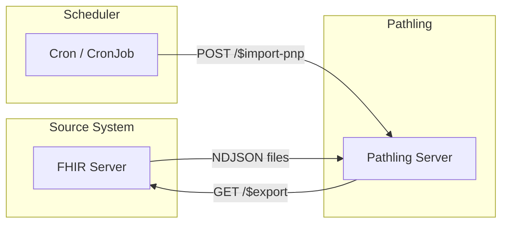

# Synchronization

Pathling can be kept in sync with a source FHIR server that supports
[FHIR Bulk Data Export](https://hl7.org/fhir/uv/bulkdata/). This is useful when
you want to use Pathling's analytics capabilities on data that originates from
another system.

The [`$import-pnp` operation](/docs/server/operations/import-pnp) fetches data
directly from a bulk export endpoint. By running this operation on a schedule,
you can keep Pathling synchronized with your source system.



## Configuration

Before setting up synchronization, configure Pathling with the authentication
credentials for the source server. See the
[ping and pull configuration](/docs/server/configuration#ping-and-pull) section.

Example configuration for a source server using SMART Backend Services
authentication:

```yaml
pathling:
  import:
    pnp:
      clientId: pathling-client
      tokenEndpoint: https://source-server.example.com/auth/token
      privateKeyJwk: '{"kty":"RSA","n":"...","e":"AQAB","d":"...","p":"...","q":"...","dp":"...","dq":"...","qi":"..."}'
      scope: system/*.read
```

## Sync script

The following script invokes the `$import-pnp` operation and waits for
completion. Save it as `sync.sh`:

```bash
#!/bin/bash
set -euo pipefail

PATHLING_URL="${PATHLING_URL:-http://localhost:8080/fhir}"
SOURCE_EXPORT_URL="${SOURCE_EXPORT_URL:-https://source-server.example.com/fhir/\$export}"
SAVE_MODE="${SAVE_MODE:-merge}"
TIMEOUT="${TIMEOUT:-7200}"

# Kick off the import
echo "Starting import from: $SOURCE_EXPORT_URL"
RESPONSE=$(curl -s -w "\n%{http_code}" -X POST "$PATHLING_URL/\$import-pnp" \
  -H "Content-Type: application/fhir+json" \
  -H "Accept: application/fhir+json" \
  -H "Prefer: respond-async" \
  -d "{
    \"resourceType\": \"Parameters\",
    \"parameter\": [
      {\"name\": \"exportUrl\", \"valueUrl\": \"$SOURCE_EXPORT_URL\"},
      {\"name\": \"saveMode\", \"valueCode\": \"$SAVE_MODE\"}
    ]
  }")

HTTP_CODE=$(echo "$RESPONSE" | tail -n1)
BODY=$(echo "$RESPONSE" | sed '$d')

if [ "$HTTP_CODE" != "202" ]; then
  echo "Failed to start import: HTTP $HTTP_CODE"
  echo "$BODY"
  exit 1
fi

# Extract status URL from Content-Location header
STATUS_URL=$(curl -s -I -X POST "$PATHLING_URL/\$import-pnp" \
  -H "Content-Type: application/fhir+json" \
  -H "Accept: application/fhir+json" \
  -H "Prefer: respond-async" \
  -d "{
    \"resourceType\": \"Parameters\",
    \"parameter\": [
      {\"name\": \"exportUrl\", \"valueUrl\": \"$SOURCE_EXPORT_URL\"},
      {\"name\": \"saveMode\", \"valueCode\": \"$SAVE_MODE\"}
    ]
  }" | grep -i "Content-Location" | cut -d' ' -f2 | tr -d '\r')

echo "Polling status: $STATUS_URL"

# Poll until complete
START_TIME=$(date +%s)
INTERVAL=5

while true; do
  ELAPSED=$(($(date +%s) - START_TIME))
  if [ $ELAPSED -gt $TIMEOUT ]; then
    echo "Timeout after ${TIMEOUT}s"
    exit 1
  fi

  HTTP_CODE=$(curl -s -o /dev/null -w "%{http_code}" "$STATUS_URL" \
    -H "Accept: application/fhir+json")

  if [ "$HTTP_CODE" = "200" ]; then
    echo "Import complete"
    curl -s "$STATUS_URL" -H "Accept: application/fhir+json"
    exit 0
  elif [ "$HTTP_CODE" = "202" ]; then
    echo "In progress... (${ELAPSED}s elapsed)"
    sleep $INTERVAL
    # Exponential backoff up to 60s
    INTERVAL=$((INTERVAL < 60 ? INTERVAL * 3 / 2 : 60))
  else
    echo "Error: HTTP $HTTP_CODE"
    exit 1
  fi
done
```

Make the script executable:

```bash
chmod +x sync.sh
```

Test it manually:

```bash
PATHLING_URL=http://localhost:8080/fhir \
SOURCE_EXPORT_URL=https://source-server.example.com/fhir/\$export \
./sync.sh
```

## Scheduling with cron

On Linux or macOS, use cron to run the sync script on a schedule.

Edit your crontab:

```bash
crontab -e
```

Add an entry to run the sync daily at 2 AM:

```cron
0 2 * * * PATHLING_URL=http://localhost:8080/fhir SOURCE_EXPORT_URL=https://source-server.example.com/fhir/\$export /path/to/sync.sh >> /var/log/pathling-sync.log 2>&1
```

## Scheduling with Kubernetes CronJob

For Kubernetes deployments, use a
[CronJob](https://kubernetes.io/docs/concepts/workloads/controllers/cron-jobs/)
to run the sync on a schedule.

```yaml
apiVersion: batch/v1
kind: CronJob
metadata:
  name: pathling-sync
spec:
  schedule: "0 2 * * *"  # Daily at 2 AM
  concurrencyPolicy: Forbid
  jobTemplate:
    spec:
      template:
        spec:
          containers:
            - name: sync
              image: curlimages/curl:latest
              env:
                - name: PATHLING_URL
                  value: "http://pathling:8080/fhir"
                - name: SOURCE_EXPORT_URL
                  value: "https://source-server.example.com/fhir/$export"
                - name: SAVE_MODE
                  value: "merge"
              command:
                - /bin/sh
                - -c
                - |
                  # Kick off import
                  STATUS_URL=$(curl -s -D - -X POST "$PATHLING_URL/\$import-pnp" \
                    -H "Content-Type: application/fhir+json" \
                    -H "Accept: application/fhir+json" \
                    -H "Prefer: respond-async" \
                    -d "{
                      \"resourceType\": \"Parameters\",
                      \"parameter\": [
                        {\"name\": \"exportUrl\", \"valueUrl\": \"$SOURCE_EXPORT_URL\"},
                        {\"name\": \"saveMode\", \"valueCode\": \"$SAVE_MODE\"}
                      ]
                    }" | grep -i "Content-Location" | cut -d' ' -f2 | tr -d '\r')

                  echo "Polling: $STATUS_URL"

                  # Poll until complete (timeout 2 hours)
                  for i in $(seq 1 240); do
                    CODE=$(curl -s -o /dev/null -w "%{http_code}" "$STATUS_URL")
                    if [ "$CODE" = "200" ]; then
                      echo "Complete"
                      exit 0
                    fi
                    sleep 30
                  done
                  echo "Timeout"
                  exit 1
          restartPolicy: OnFailure
```

## Considerations

### Save mode

Choose the appropriate save mode for your use case:

- **`merge`** — Best for incremental sync. Updates existing resources and adds
  new ones. Use with `_since` parameter on the export URL for efficient
  incremental updates.
- **`overwrite`** — Best for full replacement. Deletes all existing data of each
  type before importing. Ensures exact mirror of source system.

### Sync frequency

Consider these factors when choosing sync frequency:

- **Data freshness requirements** — How current does the data need to be?
- **Source system load** — Bulk exports can be resource-intensive
- **Data volume** — Larger datasets take longer to export and import
- **Network bandwidth** — Consider the time to transfer data

For most analytics use cases, daily or hourly sync is sufficient.

### Incremental sync

For large datasets, use incremental sync to reduce load:

```bash
SOURCE_EXPORT_URL="https://source-server.example.com/fhir/\$export?_since=2025-01-01T00:00:00Z"
```

Track the last successful sync time and use it for the next `_since` parameter.

### Error handling

- **Retry logic** — The CronJob's `restartPolicy: OnFailure` provides automatic
  retries
- **Monitoring** — Set up alerts on job failures using your monitoring system
- **Logging** — Ensure logs are captured for troubleshooting
