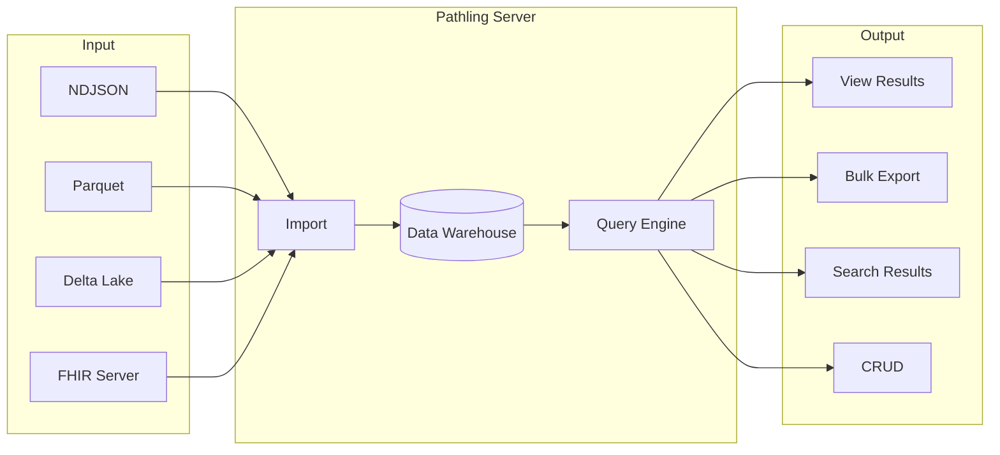

# Server

Pathling Server is a FHIR R4 analytics server that exposes a range of
functionality for use by applications.

The server implements:

- **SQL on FHIR**: [Run](/docs/server/operations/view-run) view definitions to
  preview tabular projections of FHIR data,
  then [export](/docs/server/operations/view-export) to NDJSON, CSV, or Parquet
- **Bulk Data Access**: [Export data](/docs/server/operations/export) at system,
  patient, or group level using the FHIR Bulk Data Access specification
- **Bulk Import**: [Import data](/docs/server/operations/import) from NDJSON,
  Parquet, or Delta Lake sources,
  or [sync with another FHIR server](/docs/server/deployment/synchronization)
  that supports bulk export
- **[Bulk Submit](/docs/server/operations/bulk-submit)**: An experimental
  implementation of the new Bulk Submit proposal
- **[FHIRPath Search](/docs/server/operations/search)**: Query resources using
  FHIRPath expressions
- **[CRUD Operations](/docs/server/operations/crud)**: Create, read, update, and
  delete resources

The server is distributed as a Docker image. It
supports [authentication](/docs/server/authorization) and can be scaled over a
cluster on [Kubernetes](/docs/server/deployment/kubernetes) or other Apache
Spark clustering solutions.

## Getting started

- [Getting started](/docs/server/getting-started) - Quick start guide with
  Docker
- [Configuration](/docs/server/configuration) - Environment variables and server
  settings
- [Deployment](/docs/server/deployment/kubernetes) - Kubernetes and AWS
  deployment options
