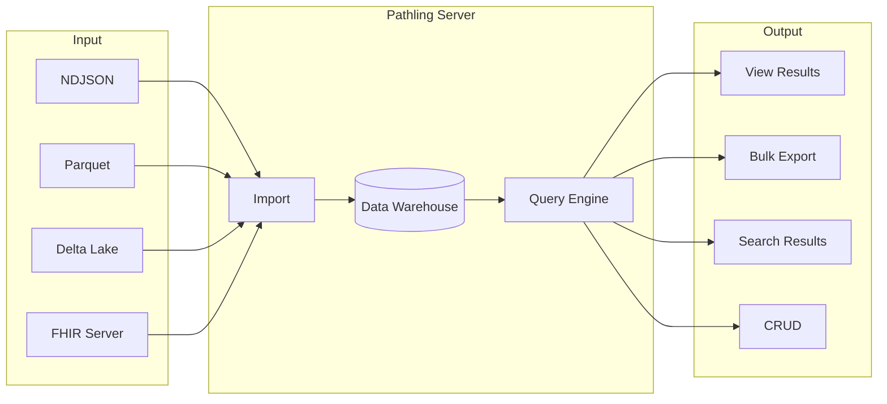

# Server

Pathling Server is a FHIR R4 analytics server that exposes a range of
functionality for use by applications.

The server implements:

- **SQL on FHIR**: [Run](operations/view-run) view definitions to preview
  tabular projections of FHIR data,
  then [export](operations/view-export) to NDJSON, CSV, or Parquet
- **Bulk Data Access**: [Export data](operations/export) at system, patient, or
  group level using the FHIR Bulk Data Access specification
- **Bulk Import**: [Import data](operations/import) from NDJSON, Parquet, or
  Delta Lake sources,
  or [sync with another FHIR server](deployment/synchronization) that supports
  bulk export
- **[Bulk Submit](operations/bulk-submit)**: An experimental implementation of
  the new Bulk Submit proposal
- **[FHIRPath Search](operations/search)**: Query resources using FHIRPath
  expressions
- **[CRUD Operations](operations/crud)**: Create, read, update, and delete
  resources

The server is distributed as a Docker image. It
supports [authentication](authorization) and can be scaled over a cluster
on [Kubernetes](deployment/kubernetes) or other Apache Spark clustering
solutions.

## Getting started

- [Configuration](configuration) - Environment variables and server settings
- [Deployment](deployment) - Kubernetes and AWS deployment options
