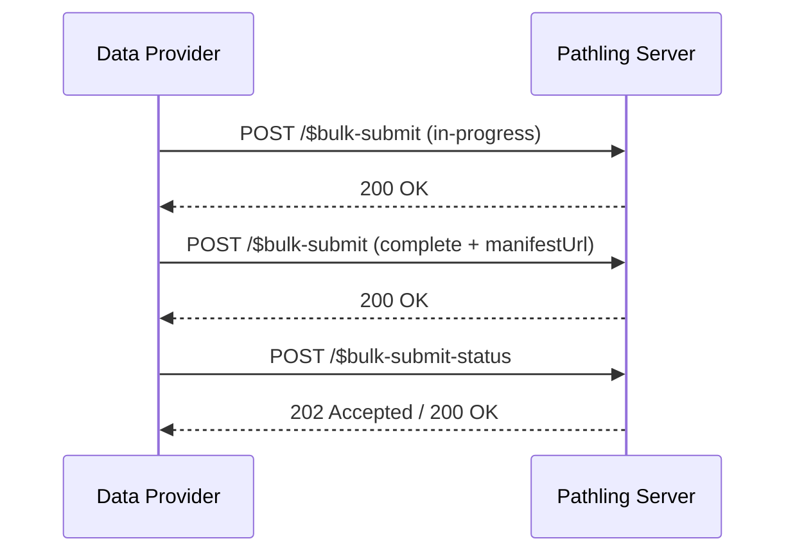

# Bulk submit

The bulk submit operation enables external systems (Data Providers) to push
large
FHIR datasets to Pathling using a staged submission workflow. This
implementation
follows
the [Argonaut $bulk-submit specification](https://hackmd.io/@argonaut/rJoqHZrPle).

## Operations

The bulk submit functionality consists of two operations:

| Operation             | Endpoint                               | Purpose                                      |
|-----------------------|----------------------------------------|----------------------------------------------|
| `$bulk-submit`        | `POST [fhir base]/$bulk-submit`        | Submit data manifests for processing         |
| `$bulk-submit-status` | `POST [fhir base]/$bulk-submit-status` | Check submission status and retrieve results |

## Submission workflow

The bulk submit operation uses a staged workflow:

1. **Notify** — The Data Provider sends an initial request with
   `submissionStatus: in-progress`
   to notify Pathling that a submission is starting.
2. **Submit manifest** — Once the bulk export is complete, the Data Provider
   sends another
   request with `submissionStatus: complete` and provides the `manifestUrl`
   pointing to
   the bulk data manifest.
3. **Poll status** — The Data Provider uses `$bulk-submit-status` to check the
   processing
   status and retrieve results.



## $bulk-submit operation

```
POST [fhir base]/$bulk-submit
```

### Parameters

| Name                  | Cardinality | Type       | Description                                                                                        |
|-----------------------|-------------|------------|----------------------------------------------------------------------------------------------------|
| `submitter`           | 1..1        | Identifier | Identifier for the submitting system. Must match an entry in the server's allowed submitters list. |
| `submissionId`        | 1..1        | string     | Unique identifier for this submission, generated by the submitter.                                 |
| `submissionStatus`    | 1..1        | Coding     | Status of the submission: `in-progress`, `complete`, or `aborted`.                                 |
| `manifestUrl`         | 0..1        | string     | URL of the bulk export manifest. Required when `submissionStatus` is `complete`.                   |
| `fhirBaseUrl`         | 0..1        | string     | Base URL of the FHIR server that produced the manifest. Required when `manifestUrl` is provided.   |
| `replacesManifestUrl` | 0..1        | string     | URL of a previous manifest that this submission replaces.                                          |
| `fileRequestHeader`   | 0..*        | -          | Custom HTTP headers to include when downloading files from the manifest.                           |
| `metadata`            | 0..1        | -          | Optional metadata including `label` and `description` for the submission.                          |

### Submission status values

| Status        | Description                                                                            |
|---------------|----------------------------------------------------------------------------------------|
| `in-progress` | The export is still running. Additional requests may follow.                           |
| `complete`    | The export is finished and the manifest is available. No further requests will follow. |
| `aborted`     | The export was cancelled. Previously submitted data may be deleted.                    |

### Example request (initial notification)

```json
{
    "resourceType": "Parameters",
    "parameter": [
        {
            "name": "submitter",
            "valueIdentifier": {
                "system": "https://example.com/systems",
                "value": "hospital-ehr"
            }
        },
        {
            "name": "submissionId",
            "valueString": "submission-2025-001"
        },
        {
            "name": "submissionStatus",
            "valueCoding": {
                "system": "http://hl7.org/fhir/uv/bulkdata/CodeSystem/bulk-data-status",
                "code": "in-progress"
            }
        }
    ]
}
```

### Example request (complete with manifest)

```json
{
    "resourceType": "Parameters",
    "parameter": [
        {
            "name": "submitter",
            "valueIdentifier": {
                "system": "https://example.com/systems",
                "value": "hospital-ehr"
            }
        },
        {
            "name": "submissionId",
            "valueString": "submission-2025-001"
        },
        {
            "name": "submissionStatus",
            "valueCoding": {
                "system": "http://hl7.org/fhir/uv/bulkdata/CodeSystem/bulk-data-status",
                "code": "complete"
            }
        },
        {
            "name": "manifestUrl",
            "valueString": "https://source-server.example.com/export/manifest.json"
        },
        {
            "name": "fhirBaseUrl",
            "valueString": "https://source-server.example.com/fhir"
        }
    ]
}
```

## $bulk-submit-status operation

```
POST [fhir base]/$bulk-submit-status
```

This operation retrieves the processing status and results for a submission.

### Parameters

| Name           | Cardinality | Type       | Description                                       |
|----------------|-------------|------------|---------------------------------------------------|
| `submitter`    | 1..1        | Identifier | The identifier of the submitting system.          |
| `submissionId` | 1..1        | string     | The unique identifier of the submission to check. |

### Required headers

| Header   | Value                   | Description                                    |
|----------|-------------------------|------------------------------------------------|
| `Accept` | `application/fhir+json` | Specifies the response format.                 |
| `Prefer` | `respond-async`         | Indicates asynchronous processing is expected. |

### Responses

| Status | Description                                                                   |
|--------|-------------------------------------------------------------------------------|
| 202    | Processing in progress. Poll again later. `Content-Location` header provided. |
| 200    | Processing complete. Response body contains the status manifest.              |
| 4XX    | Error. Response body contains an OperationOutcome.                            |

### Example request

```json
{
    "resourceType": "Parameters",
    "parameter": [
        {
            "name": "submitter",
            "valueIdentifier": {
                "system": "https://example.com/systems",
                "value": "hospital-ehr"
            }
        },
        {
            "name": "submissionId",
            "valueString": "submission-2025-001"
        }
    ]
}
```

## Configuration

The bulk submit operation requires server configuration to specify allowed
submitters
and source URLs.

### Configuration options

| Property                                | Type | Description                                              |
|-----------------------------------------|------|----------------------------------------------------------|
| `pathling.bulkSubmit.allowedSubmitters` | List | List of allowed submitter identifiers (system and value) |
| `pathling.bulkSubmit.allowableSources`  | List | URL prefixes allowed for manifest and file URLs          |

### Example configuration

```yaml
pathling:
    bulkSubmit:
        allowedSubmitters:
            -   system: "https://example.com/systems"
                value: "hospital-ehr"
            -   system: "https://example.com/systems"
                value: "clinic-system"
        allowableSources:
            - "https://source-server.example.com/"
            - "s3://my-bucket/"
```

## Python example

The following Python script demonstrates the complete bulk submit workflow,
including initial notification, manifest submission, and status polling.

Run the script using [uv](https://docs.astral.sh/uv/):

```bash
uv run bulk_submit_client.py
```

### Bulk submit client

```python
#!/usr/bin/env python3
# /// script
# requires-python = ">=3.10"
# dependencies = ["requests"]
# ///
"""Demonstrates the $bulk-submit workflow with status polling."""

import time
import uuid
import requests

# Configuration
PATHLING_URL = "https://pathling.example.com/fhir"
SUBMITTER_SYSTEM = "https://example.com/systems"
SUBMITTER_VALUE = "hospital-ehr"
MANIFEST_URL = "https://source-server.example.com/export/manifest.json"
FHIR_BASE_URL = "https://source-server.example.com/fhir"


def build_submitter():
    """Build the submitter identifier."""
    return {
        "system": SUBMITTER_SYSTEM,
        "value": SUBMITTER_VALUE
    }


def notify_in_progress(submission_id):
    """Send initial notification that a submission is starting."""
    params = {
        "resourceType": "Parameters",
        "parameter": [
            {"name": "submitter", "valueIdentifier": build_submitter()},
            {"name": "submissionId", "valueString": submission_id},
            {
                "name": "submissionStatus",
                "valueCoding": {
                    "system": "http://hl7.org/fhir/uv/bulkdata/CodeSystem/bulk-data-status",
                    "code": "in-progress"
                }
            }
        ]
    }

    response = requests.post(
        f"{PATHLING_URL}/$bulk-submit",
        json=params,
        headers={"Content-Type": "application/fhir+json"}
    )
    response.raise_for_status()
    print(f"Notified server of in-progress submission: {submission_id}")


def submit_manifest(submission_id, manifest_url, fhir_base_url):
    """Submit the completed manifest."""
    params = {
        "resourceType": "Parameters",
        "parameter": [
            {"name": "submitter", "valueIdentifier": build_submitter()},
            {"name": "submissionId", "valueString": submission_id},
            {
                "name": "submissionStatus",
                "valueCoding": {
                    "system": "http://hl7.org/fhir/uv/bulkdata/CodeSystem/bulk-data-status",
                    "code": "complete"
                }
            },
            {"name": "manifestUrl", "valueString": manifest_url},
            {"name": "fhirBaseUrl", "valueString": fhir_base_url}
        ]
    }

    response = requests.post(
        f"{PATHLING_URL}/$bulk-submit",
        json=params,
        headers={"Content-Type": "application/fhir+json"}
    )
    response.raise_for_status()
    print(f"Submitted manifest: {manifest_url}")


def poll_status(submission_id, timeout=3600):
    """Poll the status endpoint until processing is complete."""
    params = {
        "resourceType": "Parameters",
        "parameter": [
            {"name": "submitter", "valueIdentifier": build_submitter()},
            {"name": "submissionId", "valueString": submission_id}
        ]
    }

    headers = {
        "Content-Type": "application/fhir+json",
        "Accept": "application/fhir+json",
        "Prefer": "respond-async"
    }

    # Initial kick-off request
    response = requests.post(
        f"{PATHLING_URL}/$bulk-submit-status",
        json=params,
        headers=headers
    )

    if response.status_code == 200:
        print("Processing already complete")
        return response.json()
    elif response.status_code != 202:
        response.raise_for_status()

    status_url = response.headers.get("Content-Location")
    if not status_url:
        raise ValueError("No Content-Location header in 202 response")

    print(f"Polling status at: {status_url}")

    start = time.time()
    interval = 2.0

    while time.time() - start < timeout:
        response = requests.get(
            status_url,
            headers={"Accept": "application/fhir+json"}
        )

        if response.status_code == 200:
            print("Processing complete")
            return response.json()
        elif response.status_code == 202:
            progress = response.headers.get("X-Progress", "unknown")
            print(f"In progress: {progress}")
            time.sleep(interval)
            interval = min(interval * 1.5, 30.0)
        else:
            response.raise_for_status()

    raise TimeoutError(f"Status polling timed out after {timeout} seconds")


def main():
    """Execute the complete bulk submit workflow."""
    submission_id = f"submission-{uuid.uuid4()}"

    print(f"Starting bulk submit workflow")
    print(f"Submission ID: {submission_id}")
    print()

    # Step 1: Notify that submission is starting
    notify_in_progress(submission_id)

    # Step 2: Submit the manifest (in real usage, this would happen after
    # the bulk export completes on the source system)
    submit_manifest(submission_id, MANIFEST_URL, FHIR_BASE_URL)

    # Step 3: Poll for status
    result = poll_status(submission_id)
    print()
    print("Result:")
    print(result)


if __name__ == "__main__":
    main()
```
