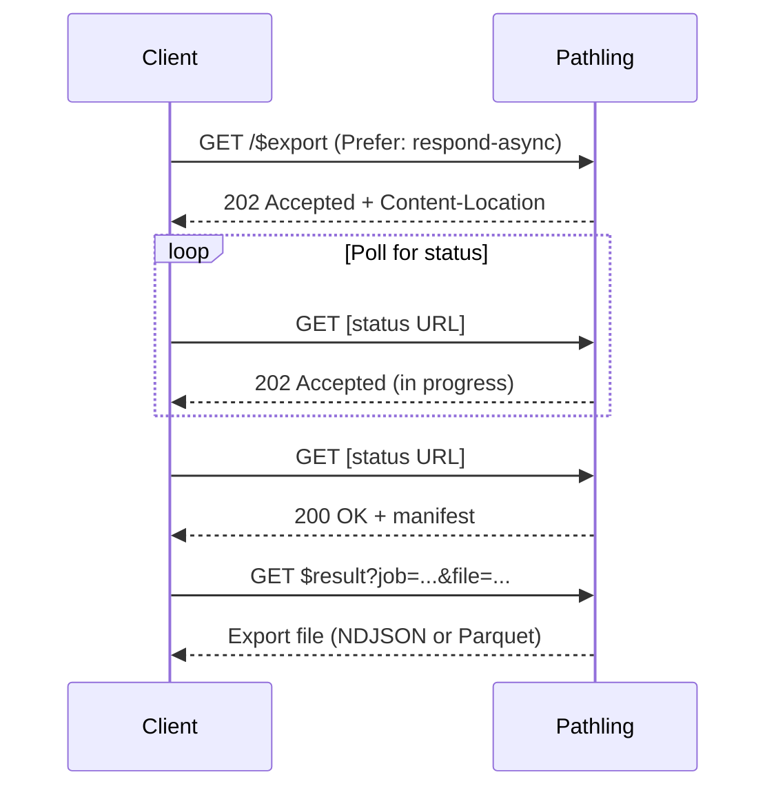

# Export

The export operation allows FHIR data to be exported from Pathling in bulk. This
implementation follows the
[FHIR Bulk Data Access specification](https://build.fhir.org/ig/HL7/bulk-data/export.html).

## Export levels

Pathling supports export at multiple levels:

| Level            | Endpoint                          | Description                                       |
| ---------------- | --------------------------------- | ------------------------------------------------- |
| System           | `GET [base]/$export`              | Export all resources in the server                |
| Patient type     | `GET [base]/Patient/$export`      | Export all resources in the Patient compartment   |
| Patient instance | `GET [base]/Patient/[id]/$export` | Export resources for a specific patient           |
| Group            | `GET [base]/Group/[id]/$export`   | Export resources for patients in a specific group |

## Parameters

| Name            | Cardinality | Type    | Description                                                                                                                                                                                                                     |
| --------------- | ----------- | ------- | ------------------------------------------------------------------------------------------------------------------------------------------------------------------------------------------------------------------------------- |
| `_outputFormat` | 0..1        | string  | The format for exported files. Accepts `application/fhir+ndjson`, `application/ndjson`, `ndjson`, `application/vnd.apache.parquet`, or `parquet`. Defaults to `application/fhir+ndjson`. See [Output formats](#output-formats). |
| `_since`        | 0..1        | instant | Only include resources where `meta.lastUpdated` is after this time.                                                                                                                                                             |
| `_until`        | 0..1        | instant | Only include resources where `meta.lastUpdated` is before this time.                                                                                                                                                            |
| `_type`         | 0..\*       | string  | Comma-delimited list of resource types to export. If omitted, all supported types are exported. Invalid types cause an error unless the `Prefer: handling=lenient` header is included.                                          |
| `_elements`     | 0..\*       | string  | Comma-delimited list of elements to include. Specify as `[type].[element]` (e.g., `Patient.name`) or `[element]` for all types. Only top-level elements are supported. Mandatory elements are always included.                  |

## Output formats

Pathling supports two output formats for bulk export:

### NDJSON

The default format is [NDJSON](http://ndjson.org/) (Newline Delimited JSON),
which outputs one FHIR resource per line as JSON. This format is specified by
the FHIR Bulk Data Access specification and is widely supported by FHIR tools.

Use `application/fhir+ndjson`, `application/ndjson`, or `ndjson` as the
`_outputFormat` value.

### Parquet

Pathling also supports export to [Apache Parquet](https://parquet.apache.org/)
format, which provides efficient columnar storage suitable for analytics
workloads. Parquet files are significantly smaller than NDJSON and can be
queried directly using tools like Apache Spark, DuckDB, or pandas.

Use `application/vnd.apache.parquet` or `parquet` as the `_outputFormat` value.

The Parquet output follows the
[Pathling Parquet specification](/docs/libraries/io/schema), which defines how
FHIR resources are represented in the Parquet schema.

## Asynchronous processing

The export operation uses the
[FHIR Asynchronous Request Pattern](https://hl7.org/fhir/R4/async.html). Include
a `Prefer: respond-async` header to initiate asynchronous processing.



### Kick-off request

Parameters can be passed either as query parameters in a GET request or as a
FHIR [Parameters](https://hl7.org/fhir/R4/parameters.html) resource in the body
of a POST request.

Using GET with query parameters:

```http
GET [base]/$export?_type=Patient,Observation&_outputFormat=parquet HTTP/1.1
Accept: application/fhir+json
Prefer: respond-async
```

Using POST with a Parameters resource:

```http
POST [base]/$export HTTP/1.1
Accept: application/fhir+json
Content-Type: application/fhir+json
Prefer: respond-async

{
    "resourceType": "Parameters",
    "parameter": [
        {
            "name": "_type",
            "valueString": "Patient,Observation"
        },
        {
            "name": "_outputFormat",
            "valueString": "parquet"
        }
    ]
}
```

### Kick-off response

```http
HTTP/1.1 202 Accepted
Content-Location: [base]/$exportstatus/[job-id]
```

### Polling

Poll the URL from `Content-Location` until you receive a `200 OK` response with
the export manifest.

- `202 Accepted` — Export still in progress. Check `X-Progress` header for status.
- `200 OK` — Export complete. Response body contains the manifest.

## Response manifest

When the export completes, the response contains a JSON manifest:

```json
{
    "transactionTime": "2025-01-15T10:30:00.000Z",
    "request": "https://pathling.example.com/fhir/$export",
    "requiresAccessToken": true,
    "output": [
        {
            "type": "Patient",
            "url": "https://pathling.example.com/fhir/$result?job=abc123&file=Patient.ndjson"
        },
        {
            "type": "Observation",
            "url": "https://pathling.example.com/fhir/$result?job=abc123&file=Observation.ndjson"
        }
    ],
    "deleted": [],
    "error": []
}
```

### Manifest fields

| Field                 | Description                                                 |
| --------------------- | ----------------------------------------------------------- |
| `transactionTime`     | The time the export was initiated                           |
| `request`             | The original kick-off request URL                           |
| `requiresAccessToken` | Whether authentication is required to download result files |
| `output`              | Array of exported files with resource type and download URL |
| `deleted`             | Array of deleted resources (not currently supported)        |
| `error`               | Array of OperationOutcome files for any errors              |

## Retrieving results

Download exported files using the URLs in the manifest. Each URL points to the
`$result` endpoint with `job` and `file` query parameters.

For NDJSON exports:

```http
GET [base]/$result?job=abc123&file=Patient.ndjson HTTP/1.1
Accept: application/fhir+ndjson
```

For Parquet exports:

```http
GET [base]/$result?job=abc123&file=Patient.parquet HTTP/1.1
Accept: application/vnd.apache.parquet
```

The file extension in the manifest URLs reflects the requested output format.

## Python example

The following Python script demonstrates the complete export workflow.

Run the script using [uv](https://docs.astral.sh/uv/):

```bash
uv run export_client.py
```

### Export client

```python
#!/usr/bin/env python3
# /// script
# requires-python = ">=3.10"
# dependencies = ["requests"]
# ///
"""Demonstrates the $export operation with async polling."""

import time
import requests

BASE_URL = "https://pathling.example.com/fhir"
OUTPUT_DIR = "./export"


def kick_off_export(resource_types=None):
    """Initiate a bulk export."""
    url = f"{BASE_URL}/$export"
    params = {}
    if resource_types:
        params["_type"] = ",".join(resource_types)

    headers = {
        "Accept": "application/fhir+json",
        "Prefer": "respond-async"
    }

    response = requests.get(url, params=params, headers=headers)

    if response.status_code == 202:
        status_url = response.headers.get("Content-Location")
        print(f"Export started, polling: {status_url}")
        return status_url
    else:
        response.raise_for_status()


def poll_status(status_url, timeout=3600):
    """Poll the status endpoint until export completes."""
    start = time.time()
    interval = 2.0

    while time.time() - start < timeout:
        response = requests.get(
            status_url,
            headers={"Accept": "application/fhir+json"}
        )

        if response.status_code == 200:
            print("Export complete")
            return response.json()
        elif response.status_code == 202:
            progress = response.headers.get("X-Progress", "unknown")
            print(f"In progress: {progress}")
            time.sleep(interval)
            interval = min(interval * 1.5, 30.0)
        else:
            response.raise_for_status()

    raise TimeoutError(f"Export timed out after {timeout} seconds")


def download_files(manifest, output_dir):
    """Download all files from the export manifest."""
    import os
    os.makedirs(output_dir, exist_ok=True)

    for item in manifest.get("output", []):
        resource_type = item["type"]
        url = item["url"]
        filename = f"{resource_type}.ndjson"
        filepath = os.path.join(output_dir, filename)

        print(f"Downloading {resource_type}...")
        response = requests.get(
            url,
            headers={"Accept": "application/fhir+ndjson"}
        )
        response.raise_for_status()

        with open(filepath, "wb") as f:
            f.write(response.content)
        print(f"  Saved to {filepath}")


def main():
    """Execute the complete export workflow."""
    # Export specific resource types (or None for all)
    resource_types = ["Patient", "Observation", "Condition"]

    print(f"Starting export for: {', '.join(resource_types)}")
    status_url = kick_off_export(resource_types)

    manifest = poll_status(status_url)
    print(f"Manifest: {manifest}")

    download_files(manifest, OUTPUT_DIR)
    print("Export complete!")


if __name__ == "__main__":
    main()
```
