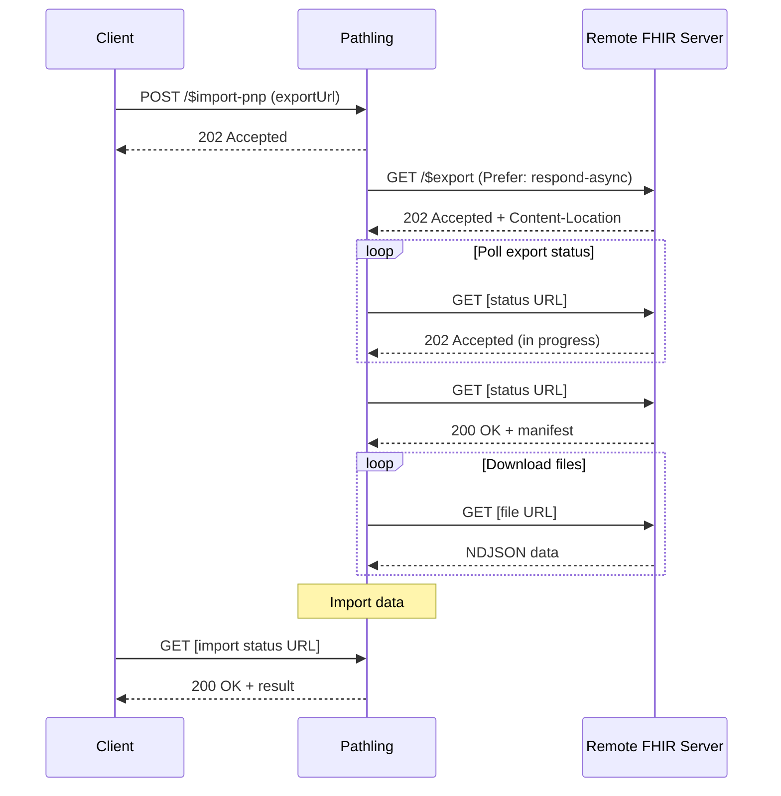

# Import (ping and pull)

The `$import-pnp` operation allows bulk FHIR data to be imported using a "Ping
and Pull" workflow. Instead of the client pushing data, Pathling fetches data
directly from a remote FHIR server's bulk export endpoint.

This implementation follows the
[SMART Bulk Data Import - Ping and Pull Approach](https://github.com/smart-on-fhir/bulk-import/blob/master/import-pnp.md)
proposal.

## How it works

1. The client provides the URL of a bulk export endpoint on a remote FHIR server
2. Pathling initiates a bulk export on that server
3. Pathling polls the export status until complete
4. Pathling downloads and imports the exported files



## Request

```
POST [base]/$import-pnp
Content-Type: application/fhir+json
Prefer: respond-async
```

The operation requires the asynchronous request pattern. Include the
`Prefer: respond-async` header.

### Example request

This example imports Patient and Observation resources modified after a specific
timestamp, using merge mode for incremental updates:

```json
{
    "resourceType": "Parameters",
    "parameter": [
        {
            "name": "exportUrl",
            "valueUrl": "https://source-server.example.com/fhir/$export"
        },
        {
            "name": "mode",
            "valueCoding": {
                "code": "merge"
            }
        },
        {
            "name": "_type",
            "valueString": "Patient"
        },
        {
            "name": "_type",
            "valueString": "Observation"
        },
        {
            "name": "_since",
            "valueInstant": "2025-01-01T00:00:00Z"
        }
    ]
}
```

## Parameters

| Name          | Cardinality | Type   | Description                                                                                                                    |
| ------------- | ----------- | ------ | ------------------------------------------------------------------------------------------------------------------------------ |
| `exportUrl`   | 1..1        | url    | The URL of the bulk export endpoint to import from. Can include query parameters (e.g., `$export?_type=Patient`).              |
| `exportType`  | 0..1        | Coding | The type of export: `dynamic` (default) includes data as of export completion, `static` includes data as of export initiation. |
| `mode`        | 0..1        | Coding | Controls how data is merged with existing resources. See [Save modes](#save-modes). Defaults to `overwrite`.                   |
| `inputFormat` | 0..1        | Coding | The format of source files. Defaults to `application/fhir+ndjson`. See [Supported formats](./import#supported-formats).        |

### Bulk export parameters

These parameters are passed through to the remote bulk export endpoint, allowing
you to filter the exported data without embedding query parameters in the export
URL.

| Name                    | Cardinality | Type    | Description                                                                        |
| ----------------------- | ----------- | ------- | ---------------------------------------------------------------------------------- |
| `_type`                 | 0..\*       | string  | Resource types to include. Repeat for multiple types.                              |
| `_since`                | 0..1        | instant | Export resources modified after this timestamp.                                    |
| `_until`                | 0..1        | instant | Export resources modified before this timestamp.                                   |
| `_outputFormat`         | 0..1        | string  | Output format for the export. Defaults to `application/fhir+ndjson`.               |
| `_elements`             | 0..\*       | string  | Elements to include in output. Experimental; support varies by server.             |
| `_typeFilter`           | 0..\*       | string  | FHIR search queries to filter resources (e.g., `Patient?active=true`).             |
| `includeAssociatedData` | 0..\*       | code    | Associated data sets to include (e.g., `LatestProvenanceResources`). Experimental. |

### Save modes

| Mode        | Description                                                       |
| ----------- | ----------------------------------------------------------------- |
| `overwrite` | Delete and replace all existing resources of each type (default)  |
| `merge`     | Match resources by ID; update existing resources and add new ones |
| `append`    | Add new resources without modifying existing ones                 |
| `ignore`    | Skip resources that already exist                                 |
| `error`     | Fail if any resources already exist                               |

## Asynchronous processing

The operation uses the
[FHIR Asynchronous Request Pattern](https://hl7.org/fhir/R4/async.html).

### Kick-off response

```http
HTTP/1.1 202 Accepted
Content-Location: [base]/$importstatus/[job-id]
```

### Polling

Poll the URL from `Content-Location` until you receive a `200 OK` response.

- `202 Accepted` — Import still in progress
- `200 OK` — Import complete

## Response

On completion, the operation returns a FHIR Parameters resource:

```json
{
    "resourceType": "Parameters",
    "parameter": [
        {
            "name": "transactionTime",
            "valueInstant": "2025-01-15T10:30:00.000Z"
        },
        {
            "name": "request",
            "valueUrl": "https://pathling.example.com/fhir/$import-pnp"
        },
        {
            "name": "output",
            "part": [
                {
                    "name": "inputUrl",
                    "valueUrl": "https://source-server.example.com/fhir/export/Patient.ndjson"
                }
            ]
        }
    ]
}
```

## Python example

The following Python script demonstrates invoking the `$import-pnp` operation.

Run the script using [uv](https://docs.astral.sh/uv/):

```bash
uv run import_pnp_client.py
```

### Import PnP client

```python
#!/usr/bin/env python3
# /// script
# requires-python = ">=3.10"
# dependencies = ["requests"]
# ///
"""Demonstrates the $import-pnp operation."""

import time
import requests

PATHLING_URL = "https://pathling.example.com/fhir"
SOURCE_EXPORT_URL = "https://source-server.example.com/fhir/$export"


def kick_off_import(export_url, mode="overwrite", types=None, since=None):
    """Initiate a ping and pull import.

    Args:
        export_url: The bulk export endpoint URL.
        mode: Save mode (overwrite, merge, append, ignore, error).
        types: Optional list of resource types to include.
        since: Optional ISO timestamp for incremental export.
    """
    parameters = [
        {"name": "exportUrl", "valueUrl": export_url},
        {"name": "mode", "valueCoding": {"code": mode}}
    ]

    # Add resource type filters.
    if types:
        for resource_type in types:
            parameters.append({"name": "_type", "valueString": resource_type})

    # Add timestamp filter for incremental sync.
    if since:
        parameters.append({"name": "_since", "valueInstant": since})

    params = {"resourceType": "Parameters", "parameter": parameters}

    headers = {
        "Content-Type": "application/fhir+json",
        "Accept": "application/fhir+json",
        "Prefer": "respond-async"
    }

    response = requests.post(
        f"{PATHLING_URL}/$import-pnp",
        json=params,
        headers=headers
    )

    if response.status_code == 202:
        status_url = response.headers.get("Content-Location")
        print(f"Import started, polling: {status_url}")
        return status_url
    else:
        response.raise_for_status()


def poll_status(status_url, timeout=7200):
    """Poll the status endpoint until import completes."""
    start = time.time()
    interval = 5.0

    while time.time() - start < timeout:
        response = requests.get(
            status_url,
            headers={"Accept": "application/fhir+json"}
        )

        if response.status_code == 200:
            print("Import complete")
            return response.json()
        elif response.status_code == 202:
            progress = response.headers.get("X-Progress", "unknown")
            print(f"In progress: {progress}")
            time.sleep(interval)
            interval = min(interval * 1.5, 60.0)
        else:
            response.raise_for_status()

    raise TimeoutError(f"Import timed out after {timeout} seconds")


def main():
    """Execute the ping and pull import."""
    print(f"Starting import from: {SOURCE_EXPORT_URL}")

    # Import only Patient and Observation resources modified since 2025-01-01.
    status_url = kick_off_import(
        SOURCE_EXPORT_URL,
        mode="merge",
        types=["Patient", "Observation"],
        since="2025-01-01T00:00:00Z"
    )
    result = poll_status(status_url)

    print("Result:")
    print(result)


if __name__ == "__main__":
    main()
```
