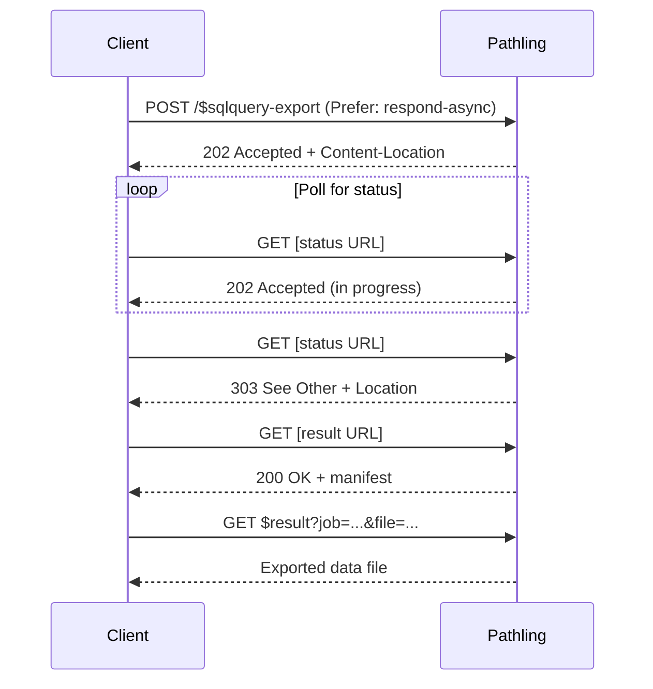

# Export SQL query

This operation is the asynchronous counterpart to the
[run SQL query](sql-run.md) operation. It runs one or more SQL queries against
materialised
[ViewDefinition](https://build.fhir.org/ig/FHIR/sql-on-fhir-v2/StructureDefinition-ViewDefinition.html)
tables and exports the results to downloadable files, following the
[SQL on FHIR specification](http://sql-on-fhir.org/OperationDefinition/$sqlquery-export)
and the [FHIR Asynchronous Request Pattern](https://hl7.org/fhir/R4/async.html).

Use this operation for result sets that are too large or too slow to retrieve
synchronously with [run SQL query](sql-run.md). Each query produces one
downloadable output.

## Endpoints

The operation is invocable at the system, type, and instance levels:

```
POST [base]/$sqlquery-export
POST [base]/Library/$sqlquery-export
POST [base]/Library/[id]/$sqlquery-export
```

At the instance level the bound `Library` is the single query source; the
`query` parameter does not apply, and per-query parameter binding is not offered
at that level.

All invocations require the `Prefer: respond-async` header.

## Parameters

| Name                   | Cardinality | Type       | Description                                                                                                |
| ---------------------- | ----------- | ---------- | ---------------------------------------------------------------------------------------------------------- |
| `query`                | 1..\*       | (parts)    | A repeating parameter (system and type levels only); each repetition is one query and produces one output. |
| `query.name`           | 0..1        | string     | Optional output name. Highest precedence in the output-name derivation.                                    |
| `query.queryReference` | 0..1        | Reference  | A reference to a stored SQLQuery `Library`. Mutually exclusive with `query.queryResource`.                 |
| `query.queryResource`  | 0..1        | Resource   | An inline SQLQuery `Library`. Mutually exclusive with `query.queryReference`.                              |
| `query.parameters`     | 0..1        | Parameters | Per-query runtime parameter bindings, bound by name to the Library's declared parameters.                  |
| `view`                 | 0..\*       | (parts)    | A repeating parameter supplying ViewDefinition table sources at request time.                              |
| `view.name`            | 0..1        | string     | Optional friendly label. Not used for matching or as an output name.                                       |
| `view.viewReference`   | 0..1        | Reference  | A reference to a stored ViewDefinition. Mutually exclusive with `view.viewResource`.                       |
| `view.viewResource`    | 0..1        | Resource   | An inline ViewDefinition. Mutually exclusive with `view.viewReference`.                                    |
| `clientTrackingId`     | 0..1        | string     | Client-provided tracking identifier; echoed in the acknowledgement and the completion manifest.            |
| `_format`              | 0..1        | code       | Output format: `ndjson` (default), `csv`, or `parquet`. An unsupported value returns `400`.                |
| `header`               | 0..1        | boolean    | Include a header row in CSV output. Defaults to `true`. Has no effect on NDJSON or Parquet.                |
| `patient`              | 0..\*       | Reference  | Filter to resources for the specified patient(s).                                                          |
| `group`                | 0..\*       | Reference  | Filter to resources for patients in the specified Group(s).                                                |
| `_since`               | 0..1        | instant    | Only include resources where `meta.lastUpdated` is at or after this time.                                  |

### Query and table sources

Each `query` part must supply exactly one of `query.queryReference` or
`query.queryResource`; supplying both, or neither, returns `400 Bad Request`. A
`query.queryReference` that does not resolve to a stored Library returns
`404 Not Found`.

A SQLQuery `Library` declares its table sources as `relatedArtifact` entries,
each labelling a ViewDefinition the SQL references. The optional `view`
parameter supplies those ViewDefinitions at request time, matched to the
`relatedArtifact` entries by ViewDefinition id. A view the SQL references but no
`view` part supplies is read from server storage, exactly as the synchronous
operation does. Each `view` part must supply exactly one of `view.viewReference`
or `view.viewResource`; supplying both, or neither, returns `400 Bad Request`. A
supplied ViewDefinition that is well-formed but semantically invalid returns
`422 Unprocessable Entity`.

A `relatedArtifact` dependency may reference a SQLView as well as a
ViewDefinition, and a SQLView may itself depend on further ViewDefinitions and
SQLViews. A SQLView may also be the top-level resource of a `query` (or the
bound Library at the instance level), running as a parameter-less query. The
dependency-graph resolution, reference disambiguation, cycle and depth limits,
and metadata-resource authorisation are identical to the synchronous operation;
see [Composing SQLViews](./sql-run.md#composing-sqlviews). These structural
rejections are returned synchronously at kick-off.

The `source` parameter (an external data source) is not supported by this
server; supplying it returns `400 Bad Request`. All of these rejections are
returned synchronously at kick-off.

## Asynchronous processing



### Kick-off request

```http
POST [base]/Library/$sqlquery-export HTTP/1.1
Content-Type: application/fhir+json
Accept: application/fhir+json
Prefer: respond-async

{
    "resourceType": "Parameters",
    "parameter": [
        {
            "name": "query",
            "part": [
                {"name": "name", "valueString": "people"},
                {
                    "name": "queryReference",
                    "valueReference": {"reference": "Library/patient-bp-query"}
                }
            ]
        }
    ]
}
```

### Kick-off response

The `202 Accepted` response carries a `Parameters` acknowledgement and a
`Content-Location` header pointing at the status URL:

```http
HTTP/1.1 202 Accepted
Content-Location: [base]/$job?id=[job-id]

{
    "resourceType": "Parameters",
    "parameter": [
        {"name": "status", "valueCode": "accepted"},
        {"name": "exportId", "valueString": "[job-id]"}
    ]
}
```

### Polling

Poll the URL from `Content-Location`:

- `202 Accepted` — Export still in progress. Check the `X-Progress` header.
- `303 See Other` — Export complete; follow the `Location` header to the result
  URL, then `GET` it for the manifest.
- `404 Not Found` — The export was cancelled (via `DELETE` on the status URL) or
  is unknown.

## Response manifest

The completion manifest is a FHIR `Parameters` resource following the SQL on
FHIR shape:

```json
{
    "resourceType": "Parameters",
    "parameter": [
        { "name": "exportId", "valueString": "abc123" },
        { "name": "status", "valueCode": "completed" },
        { "name": "clientTrackingId", "valueString": "my-tracking-id" },
        { "name": "_format", "valueCode": "ndjson" },
        {
            "name": "exportStartTime",
            "valueInstant": "2026-06-21T01:00:00.000Z"
        },
        { "name": "exportEndTime", "valueInstant": "2026-06-21T01:00:12.000Z" },
        { "name": "exportDuration", "valueInteger": 12 },
        {
            "name": "output",
            "part": [
                { "name": "name", "valueString": "people" },
                {
                    "name": "location",
                    "valueUri": "https://pathling.example.com/fhir/$result?job=abc123&file=people.00000.ndjson"
                }
            ]
        }
    ]
}
```

There is one `output` per query, each with a `name` part and one or more
`location` download URLs (a query partitioned into several files repeats the
`location` part once per file). The manifest does not include the optional
`cancelUrl` or `estimatedTimeRemaining` parameters.

## Output formats

| Format  | `_format` value | Content type                     | Description                                                    |
| ------- | --------------- | -------------------------------- | -------------------------------------------------------------- |
| NDJSON  | `ndjson`        | `application/x-ndjson`           | Newline-delimited JSON. Default format.                        |
| CSV     | `csv`           | `text/csv`                       | Comma-separated values. Use `header=false` to exclude headers. |
| Parquet | `parquet`       | `application/vnd.apache.parquet` | Apache Parquet columnar format. Efficient for large datasets.  |

## Multiple queries

Include several `query` parameters to export several result sets in one
operation. Each produces one named output. The `output.name` is derived as the
`query.name` when supplied, otherwise the Library's `name` element, otherwise a
generated unique name. If any query fails, the whole export fails (all or
nothing): no manifest is produced and the result URL returns the error status
with an OperationOutcome.

## Filtering

The `patient`, `group`, and `_since` parameters scope the exported rows in the
same way as the [export view](view-export.md) operation.

## Cancellation and lifetime

Send a `DELETE` to the status URL to cancel an in-progress export; subsequent
polls of that URL return `404 Not Found`. The result and download URLs remain
valid for at least 24 hours after completion and support repeat retrieval.

## Comparison with run SQL query

| Aspect             | Export SQL query                   | Run SQL query                              |
| ------------------ | ---------------------------------- | ------------------------------------------ |
| Processing         | Asynchronous with polling          | Synchronous                                |
| Output             | Files (download via manifest URLs) | Streamed response                          |
| Multiple queries   | Yes                                | No                                         |
| Request-time views | Yes (via the `view` parameter)     | No                                         |
| Output formats     | `ndjson`, `csv`, `parquet`         | `ndjson`, `csv`, `json`, `parquet`, `fhir` |
| Use case           | Large result sets, batch export    | Small queries, interactive use             |

## Configuration

The operation is enabled by default and can be disabled with the
`pathling.operations.sqlQueryExportEnabled` configuration setting (see
[Configuration](../configuration.md)).
