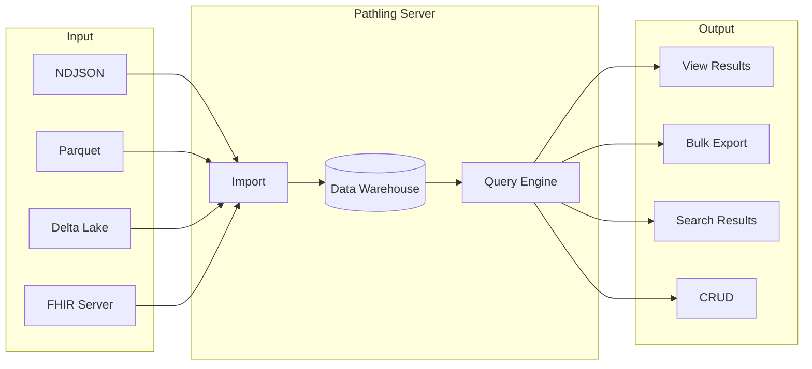

# Server

Pathling Server is a FHIR R4 analytics server that exposes a range of
functionality for use by applications.

The server implements:

- **SQL on FHIR**: [Run](./operations/view-run.md) view definitions to
  preview tabular projections of FHIR data,
  then [export](./operations/view-export.md) to NDJSON, CSV, or Parquet
- **Bulk Data Access**: [Export data](./operations/export.md) at system,
  patient, or group level using the FHIR Bulk Data Access specification
- **Bulk Import**: [Import data](./operations/import.md) from NDJSON,
  Parquet, or Delta Lake sources,
  or [sync with another FHIR server](./deployment/synchronization.md)
  that supports bulk export
- **[Bulk Submit](./operations/bulk-submit.md)**: An experimental
  implementation of the new Bulk Submit proposal
- **[FHIRPath Search](./operations/search.md)**: Query resources using
  FHIRPath expressions
- **[CRUD Operations](./operations/crud.md)**: Create, read, update, and
  delete resources

The server is distributed as a Docker image. It
supports [authentication](./authorization.md) and can be scaled over a
cluster on [Kubernetes](./deployment/kubernetes.md) or other Apache
Spark clustering solutions.

## Getting started

- [Getting started](./getting-started.md) - Quick start guide with
  Docker
- [Configuration](./configuration.md) - Environment variables and server
  settings
- [Deployment](./deployment/kubernetes.md) - Kubernetes and AWS
  deployment options
